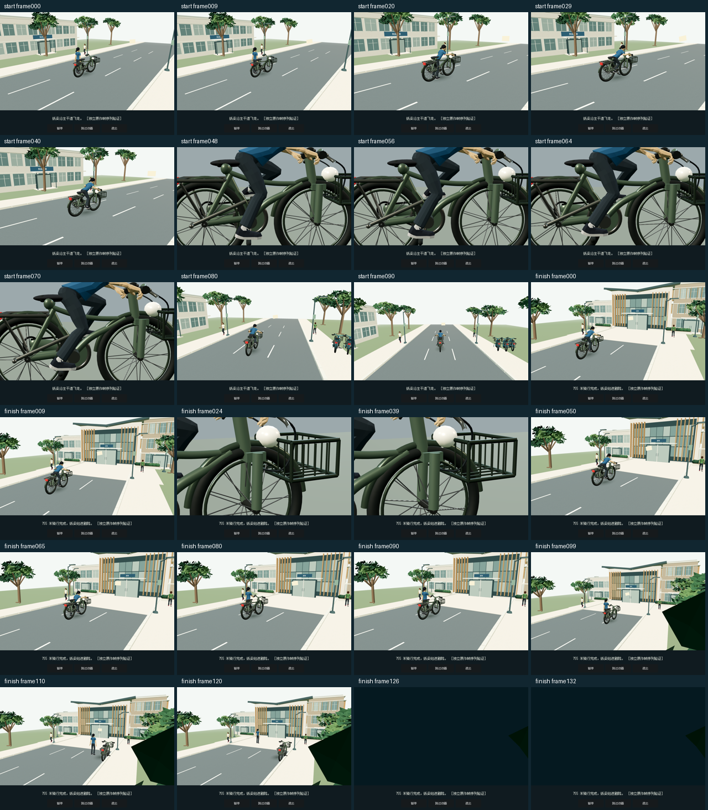

# 755 m native source 3D restoration

The previous native chase used a simplified flat presentation and omitted the original articulated bicycle transition scenes. This change renders the original rider, bicycle, procedural campus road, hazards, roadside people, paper, bell and tray effects in Godot. It restores the authored departure/mount/pedal and arrival/brake/dismount/parking/door camera beats. It does not change 755 m, obstacle rules, reward meaning, difficulty or controller proof validation.

## Ownership and recovery

A paid bicycle remains ready until departure completes or is skipped. Exit retains that paid state. The ride has one simulation/input owner; the renderer is a read-only consumer. Collision remains in the original deterministic lane/distance model, and the native 3D view uses the same world coordinates and wheel/contact anchors. Pause freezes both. Retry preserves the music owner while retiring previous-attempt collision effects. Paused Exit clears the broad audio pause key so Tasks Return can start one fresh owner.

A validated win saves the original theater approach before the optional arrival film. Skip, Exit and reload cannot grant twice. The old 3D world is released before the next scene is created. The film owns its result caption, and Exit restores world keyboard focus. Loading gets a visible status frame; resource allocation remains synchronous. Queued Return input stays with the loading owner through the first loaded frame and cannot click the new Start button.

## Layout and source resources

The camera film stays 16:9, with readable HUD and 44 px or larger native controls outside it at 390 / 430 portrait and compact landscape. The source’s 250 ms chase frame cap and 24-sample quality policy are retained. Other shared-host games keep their own behavior. Original texture bytes and procedural geometry are retained; resource chunking does not simplify them.

Source authorities are `ChaseThreeRenderer.ts`, `ChaseRiderRig.ts`, `ChaseHumanPose.ts`, `ChaseCampusEnvironment.ts`, `ChasePeople.ts`, `ChaseRoute.ts`, `CanteenBikeTransitionRenderer.ts`, `CanteenBikeTransitionTimeline.ts`, and the original Quaternius GLB. Regeneration tools are under `tools/chase_source_export` and `tools/chase_transition_export`. Shared shader programs preserve separate material uniforms. Scene-local skin/bind correction is retained where native mesh storage is not exactly identical.

## Acceptance evidence and limits

Actual ordinary paid-save copy: the native 3D ride was won at 755 m with three chances and two collisions. Departure Pause/Exit/reopen, paused Retry, Tasks Return, natural arrival and normal reload were exercised. The saved position is 3300, 1360 before the film finishes. The physical entrance then reaches the original theater story. Main campaign progress is a separate save.

Actual 430 / 390 pointer/keyboard checks exercise on-screen steering, held jump, bell, pause and Retry; 844×390 verifies field/control separation and paused Exit→Tasks Return. These are desktop cloud-window tests, not physical-device touch or a full mobile 755 m win. The corrected loading text was inspected at 430. Automated root touch tests cover multi-touch ownership and release/rotation cancellation.

All 224 authored transition frames rendered at 960×540, and a 100-frame riding fixture demonstrates steering, jump, item feedback and pause freeze. Clips assembled from source-frame fixtures are not performance benchmarks or earned gameplay. The final dark closure is the source camera-attached door occluder. Source clock tests verify the 3.75 / 5.5 s timelines.

Original browser WebGL pixel comparison is blocked in this environment. Three/Godot ACES output, exact label-font rasterization and complete pixel parity remain explicit comparison limits. The linear-grain/hemisphere adapter has a settled analytic GPU check; that does not prove whole-scene pixel identity. Audio-owner regressions and prior PCM analysis are separate from human hearing or the dummy-audio 3D replay. Final aggregate/export results are recorded below and in the PR validation receipt.

No whole-room model, inventory-art replacement, phone/world shell redesign, global typography or theater clue-inspection change is included.

## Native source-frame samples

The image below is a native render of the extracted source frame sequence. It is a controlled presentation fixture, not browser-reference pixels or the manual win.

## Final validation boundary

The frozen runtime completed 202 aggregate stages: 201 passed in that run, while one old compact-overlay fixture still expected the retired scaled canvas. The test was corrected to the physical HUD and contained source film; it then passed 184 checks, and a final parse passed 331 scripts. Runtime files did not change during that test-only correction. This is a reconciled complete result, not a single clean aggregate run.

Linux and Windows exports succeeded. The packed campaign and fresh/reload native-only checks passed with no Node or browser runtime. Windows was not executed. The final Linux executable was also operated on the ordinary paid-save copy: native 3D controls, pause, retry, compact Exit → Tasks Return, explicit save, close/reload into Ready, and world return passed. The last OS portrait size was 426×860; the earlier actual source-run checks cover exact 390/430 and compact landscape. Both final executable sessions exited cleanly, with peak RSS below 736 MiB and no new OOM kill. Their only logged warning was the driver’s unsupported V-Sync setting.

The final executable check did not repeat the full 755 m win or the arrival caption. The earlier earned-copy native 3D win and natural arrival, the final integrated lifecycle checks, and the full 224-frame presentation coverage remain separate evidence.
