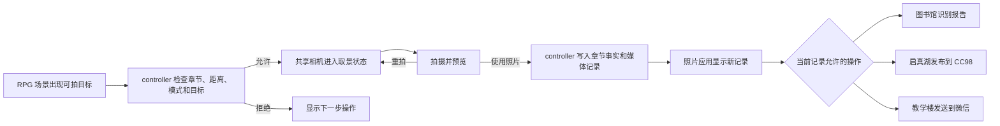

# 7:55 Project Development Report

## Completed implementation: Settings, desktop editing, and Chapter 4 CC98 study import

> **For Claude:** REQUIRED SUB-SKILL: Use the repository execution workflow task-by-task.

**Goal:** Turn Settings into a real pixel-phone app, add persisted desktop layout editing under deletion policy A, and connect the CC98 study board to the Chapter 4 Maxwell study-group investigation.

**Architecture:** `UiState` and `SaveStore` own normalized desktop order and optional-app visibility. A dedicated Settings scene reads existing capabilities, while Chapter 4 evidence stays in `chapter4.clueIds`; CC98 and WeChat expose controller-owned views of the same facts. Pointer Events and keyboard equivalents share one interaction contract.

**Tech Stack:** React, TypeScript, CSS, JSON content, existing `GameKit`, `SaveStore`, Chapter 4 controller/model, browser QA.

**Approved design:** `docs/plans/2026-08-18-settings-desktop-cc98-design.md`

### Task 1: Add persisted desktop layout state

**Files:** `src/core/types.ts`, `src/core/GameState.ts`, `src/core/SaveStore.ts`, `src/scenes/phone/P13_PhoneHome/index.tsx`

1. Define stable home-app IDs, default order, protected/removable policy, and normalization.
2. Add order and hidden optional IDs to `UiState` with old-save migration.
3. Replace fixed home JSX order with catalog rendering while preserving story locks and original slots.
4. Add long-press, drag-swap, keyboard move, delete confirmation, completion, and restore behavior.

### Task 2: Build the full Settings scene

**Files:** `src/core/types.ts`, `src/scenes/phone/registry.tsx`, `src/scenes/phone/P08_Settings/index.tsx`, `src/styles/scenes/p08-settings.css`, `src/scenes/phone/P13_PhoneHome/index.tsx`

1. Restore `settings` as a phone scene and route post-prologue Settings presses into it.
2. Build the searchable pixel settings index and real subpages.
3. Connect existing music, network/control-center, desktop, app restore, privacy diagnostics, and about data.
4. Keep Chapter 1 gear behavior intact.

### Task 3: Add controller-owned Settings investigation

**Files:** `src/modules/ChapterFourSettingsModel.ts`, `src/modules/ChapterFourTemporalMazeController.ts`, `src/scenes/phone/P08_Settings/index.tsx`, `src/core/QuestModel.ts`

1. Project the available records and accepted conflict set from Chapter 4 facts.
2. Validate selected records before appending the background-activity clue.
3. Record the optional desktop-layout clue without gating the main route.
4. Expose one current objective and readable repeat/error feedback.

### Task 4: Expand CC98 and connect the study-group import

**Files:** `src/data/cc98.posts.json`, `src/data/chapter4-cc98.content.json`, `src/scenes/phone/P02_CC98/index.tsx`, `src/modules/ChapterFourCc98Model.ts`, `src/modules/ChapterFourWechatModel.ts`, `src/scenes/phone/P14_Wechat/index.tsx`

1. Merge new default posts by ID so old local edits remain and newly shipped posts appear.
2. Show the Chapter 4 study thread only at its intended phase.
3. Route the existing `资料索引机` post into the same Chapter 4 study thread while the chapter is active, with a visible pending/completed import status.
4. Validate the three selected study facts, import the route into the Maxwell group, and persist one clue.
5. Render the imported summary in WeChat, while live student messages remain the route authority.

### Task 5: Verify without packaging

1. Run `npm run typecheck` and `npm run chapter4:validate-topology`.
2. Run path-scoped whitespace validation.
3. Exercise Settings entry, desktop mouse/touch/keyboard edits, deletion recovery, CC98 import, WeChat continuation, save/reload, and one old-save fixture in a real browser.
4. Inspect `430 × 860` and `390 × 844` with zero document overflow and zero console errors.
5. Record results in `progress.md`. Do not build or edit the standalone demo in this development pass.

### Completion and verification

- Persisted desktop editing is active: long press enters edit mode, pointer drag and keyboard arrows reorder applications, protected story applications ignore Delete, and only eligible optional applications render a remove control.
- Settings is a registered phone scene with eight searchable sections. Its Chapter 4 background-activity puzzle accepts the three authored 07:55 records and persists the resulting clue through `ChapterFourTemporalMazeController`.
- The CC98 feed merges shipped posts by stable ID without deleting local edits. The existing `资料索引机` row now opens the same Chapter 4 study-index thread and reports `可导入自习群 / 已导入自习群` in place. The thread validates three evidence choices, imports a compact index into the Maxwell WeChat group, and then hands route confirmation back to live student messages.
- One Blink gameplay run completed the full Settings record selection, CC98 import, WeChat archive open, and route-save chain. Desktop editing was checked with long press, protected-app Delete rejection, keyboard reordering, and navigation persistence.
- `390×844` checks of Settings, Phone Home, the expanded CC98 feed, and the legacy-post import entry reported zero document overflow; browser console errors were zero. The legacy `资料索引机` entry opened the same import panel in Blink, Firefox, and WebKit, with zero document overflow and console errors at the mobile viewport. A browser-created version-23 fixture without the new desktop fields loaded with the normalized default order and an empty hidden list.
- `npm run typecheck`, `npm run chapter4:validate-topology`, and path-scoped whitespace checks pass. Per the explicit development constraint, `npm run build:single` was not run and `demo/index.html` was not regenerated.

## Completed slice: Chapter 4 clock content expansion

- Corrected scope: the clock sequence now contains four gameplay levels with distinct internal progress; four DEV entries remain test shortcuts only.
- Level 1 rebuilds the B2-04 archive from three valid records and then selects the supported time anchor.
- Level 2 independently tunes and locks the hour and minute movements.
- Level 3 applies inverse corrections to gate, elevator, and classroom drift channels.
- Level 4 changes window width, speed, direction, and offset across three release protocols; failure resets protocol progress.
- Save version 21 persists archive clues, movement locks, corrected drift channels, and drift attempts. Version-20 saves infer completed internal facts from their existing clock step.
- Browser evidence: one full Blink playthrough reached `complete` with `3 archive clues / 2 movement locks / 3 corrected channels / 3 protocol hits`; all four DEV starts were inspected; `390×844` had zero document and scene overflow; console errors were zero.
- Delivery evidence: typecheck, Chapter 4 topology validation, scoped whitespace validation, single-file build, and single-file verification pass. The rebuilt artifact was reopened over HTTP at level 3 with the expected persisted prerequisites, zero overflow, and zero console errors. Artifact: `176572880 bytes`, SHA-256 `427c3237114b152db1f9ee900efad52961dda9b61bab02a9b74a53f0030441cc`.

## Completed slice: Chapter 4 four-stage clock calibration

- The clock page now has four controller-owned, persisted stages: target-card selection, hour/minute coarse wheels, second-only trimming, and a three-hit phase-release gate. Completing the gate writes `clock_phase_lock`, restores `08:00:00`, and closes Chapter 4.
- Four DEV checkpoints map one-to-one to those stages: `c4-clock-intro`, `c4-clock-coarse`, `c4-clock-precision`, and `c4-clock-release`. Version-19 saves migrate to the nearest matching stage under save version 20.
- The phone UI was rebuilt as an original high-contrast pixel terminal with a status ribbon, four-step rail, scene-time cards, digit reels, second ruler, timing lane, and completion ledger. The design uses the time-segment selection principle as a broad reference while keeping local art, labels, layout, and interaction rules.
- Blink validation covered every checkpoint plus one complete run from `07:55:23` to `complete`. The `699×739` scaled desktop and `390×844` mobile viewports reported zero document or clock-page overflow and zero console errors; the rebuilt offline artifact repeated the release checkpoint over local HTTP with the same result.
- `npm run typecheck`, `npm run chapter4:validate-topology`, the scoped whitespace check, `npm run build:single`, and `npm run verify:single` pass. The rebuilt standalone artifact is `176562655 bytes`.

## Completed slice: Qizhen sixth-capsize subtitle

- The persisted Qizhen `capsizeCount` remains the single threshold authority. When the count crosses from `5` to `6`, the controller emits one `qizhen_capsize_loss_subtitle_unlocked` event.
- The Qizhen Phaser scene consumes that event through the shared RPG bottom subtitle layer and displays the authored narrator line for `6500ms`. The ordinary recovery message is emitted first so it cannot replace the threshold subtitle in the same event turn.
- The count continues to cover balance-limit capsizes caused by repeated same-side strokes or excessive roll. Bank collisions remain stop-only, and black-swan contact remains a chase-attempt failure under the existing gameplay contract.
- Validation count: `1` Blink `1280×720` threshold matrix confirmed no unlock at count `5`, exactly one event/subtitle at `6`, and no repeat at `7`; `1` real-scene same-side-stroke run visibly triggered the sixth capsize subtitle during the capsize animation. Both runs reported zero page and console errors.
- `npm run typecheck`, the scoped `git diff --check`, and `npm run build:single` pass. The rebuilt `demo/index.html` mounted `qizhen_lake` with one Phaser canvas over HTTP, contained the authored line, and reported zero errors. Artifact: `176543541 bytes`, SHA-256 `23b2a49ce5f3f2cd88e6f5ca13ece3e36c4fe181a8b04ddc67821b2c191563d9`.

## Active direction: browser-only, three-floor temporal maze plus the Chapter 4 perspective stair

**Decision date:** 2026-08-09

- The active product runtime is React + TypeScript + Phaser. `RpgGameHost` mounts one Phaser canvas for campus, canteen, library, theater, Qizhen Lake, and the teaching building. The Chapter 4 misaligned-stair puzzle is the single approved Three.js surface and replaces the Phaser surface only while that puzzle is active.
- The perspective stair now permits view changes whenever the player is stationary, including stair endpoints and mechanism platforms. View input remains locked during walking, mechanism motion, perspective-edge crossing, and camera transitions. The second level assigns different views to its two upward seams: `south_west` followed by `top_oblique`.
- The second-level perspective seams now use their authored low-to-high direction for coincident-screen-space input, so Up consistently ascends on keyboard and the shared mobile D-pad. The upper landing meets the visible edge of the high platform; the exit slide waits to the side with more than `30px` of screen clearance and docks back into the original solved corridor at state `2`. Stationary players use real depth occlusion, while only the short seam-crossing animation receives a temporary foreground override.
- The perspective stair now uses three checked-in ambientCG CC0 color sources for plaster, concrete, and metal. Runtime processing converts each source to a `64×64` grayscale pixel tile, then applies the existing scene palette through `MeshBasicMaterial`; the active material contract excludes PBR maps and continuous lighting.
- Godot loading, iframe mounting, runtime selection, asset synchronization, export commands, and CI hash checks are retired. Existing Godot files remain historical reference material.
- The teaching building now uses three separate `1672×941` orthographic top-down floor plates in one `5400×941` Phaser world. The active story scope maps directly to A1, A2, and A3.
- One main elevator and one adjacent continuous stair core provide floor travel. The elevator keeps the full hall-call, wait, arrival, double-door, boarding, cabin-selection, travel, destination-opening, exit, and reset sequence.
- A1 implements airflow evidence and elevator-history synchronization. A2 implements NPC schedule observation, two independently reconfigured partitions, two wayfinding fragments, and the 203 return window. A3 implements old-signage observation, a three-slot wayfinding board whose middle slot stays empty, bridge-history observation, and the cross-floor return.
- `ChapterFourTemporalMazeController` and `ChapterFourMazeProjection` own progression and route projection. Phaser consumes the validated layout manifest, renders the current projection, and submits engine-neutral movement and action requests.
- Three authored floor-2 routes remain open against visible geometry, and the corresponding source-pixel collisions now include the two portrait-planter obstructions. Target stand positions were moved off painted walls and planters.
- Current browser verification covers the rebuilt single file in Chromium desktop, `390×844`, and a non-16:9 `1024×768` viewport, plus Firefox and WebKit desktop. All runs mounted one `16:9` Phaser canvas with no page or console errors and no document overflow.
- The Chapter 4 prologue paper now flies above head height across the arcade, entrance, lobby, and closing corridor. The former solid trail bars were replaced with broken pixel wind marks, and the lobby cleaner pursues from ground level with a stable trailing gap.
- Current single-file artifact: `180393544 bytes`, SHA-256 `c8ea0096cac447481d47e67dde1ccc21aeade4dc4d6456ad7d7441686ed9c0e5`.
- 2026-08-12 performance pass keeps gameplay assets lossless while removing retired Godot files from active Vite output, standardizing the WOFF2 pixel-font source, sharing Phaser asset guards, and caching/merging immutable Three.js chase primitives. The rebuilt single file is `176500593 bytes`, SHA-256 `d8d47703250cb18cebd08195aa7c1477618c7fccd03a9068eef7d6f28cc2bc7c`.
- The 755 m Three.js chase now reports about `192` draw calls and `72` live geometries in the checked Firefox checkpoint, compared with `805` and `861` before this pass. Dynamic riders, paper, obstacles, pedestrians, signs, and transparent shadows remain independent; only static same-material scenery is merged.
- `src/assets/rpg/campus/zijingang_campus_plate.png` is currently present and clean against the index, so the single-file build completed directly in the working tree.
- Qizhen Lake water-ripple fishing now uses real kayak-to-ripple distance without a heading gate. The same all-chapter rule applies to the dock locker, black swan, and every other interaction target. Kayak heading remains available only to locomotion physics and non-gating visual presentation, including steering, chase, roll, wakes, and captured-image composition.
- The theater ticket flow now reconciles the visible `0832` clue, provides a readable five-second second-wave wait with live network status, accepts the first deliberate pointer digit, recovers A+B half-ticket saves, and gives the gate reader a practical distance band with no facing requirement. A Chromium gameplay run completed campus-Wi-Fi failure, cellular second-wave pickup, ticket combination, and a real inventory drag through admission into `program_search`; Firefox and WebKit also loaded the repaired theater runtime without errors or overflow.
- Current verified single-file artifact after the ticket-flow repair: `176539012 bytes`, SHA-256 `f9b61e0f4563af9fbf1556ee3546870516b5de27c7f03d011cfdec61c100eba5`.

# Chapter 4 Three-Floor Temporal Campus Maze Implementation Plan

> **For Claude:** REQUIRED SUB-SKILL: Use superpowers:executing-plans to implement this plan task-by-task.

**Goal:** Convert the approved three-floor teaching-building preview into a playable campus time maze with one elevator, one adjacent stair core, a permanently walkable circulation loop, floor-specific puzzles, cross-floor evidence, save recovery, and a rebuilt single-file demo.

**Architecture:** Keep `GameState` and `ChapterFourTemporalMazeController` as the progression authority. Add a validated layout manifest and a pure `ChapterFourMazeProjection` selector that derives visible NPCs, doors, partitions, targets, dynamic collisions, and safe checkpoints from persisted facts. Phaser renders the approved floor plates and submits engine-neutral intents; runtime animation state stays scene-local.

**Tech Stack:** React, TypeScript, Phaser 3, JSON layout/content data, existing `RpgInteractionContract`, Vite single-file build, repository validator scripts, Playwright browser gameplay loop.

---

**Approved design:** `docs/plans/2026-08-09-chapter4-three-floor-temporal-maze-design.md`

**Execution precondition:** The current worktree contains many user and collaborator edits plus untracked Chapter 4 files. Do not run broad staging, reset, restore, or cleanup commands. A separate worktree cannot reproduce the untracked Chapter 4 baseline until the user authorizes a snapshot commit; execute with path-scoped edits in the current workspace or create that snapshot first.

### Task 1: Lock the three-floor layout contract with a failing validator

**Files:**
- Create: `src/data/chapter4-three-floor-maze.layout.json`
- Modify: `scripts/verify-chapter4-temporal-maze.mjs`
- Reference: `src/data/chapter4-temporal-maze.topology.json`

**Step 1: Add failing validation rules**

Extend `verify-chapter4-temporal-maze.mjs` to require:

```js
assert.equal(layout.floors.length, 3);
assert.deepEqual(layout.floors.map((floor) => floor.storyFloor), ["A1", "A2", "A3"]);
assert.equal(layout.transportCore.elevators.length, 1);
assert.equal(layout.transportCore.stairs.length, 1);
assert.ok(layout.safeRoutes.floor2South.height >= 128);
assert.ok(layout.safeRoutes.floor2East.width >= 128);
```

Also reject `B2`, `B3`, and `A4` from the three-floor runtime mapping, duplicate transport IDs, safe-route rectangles outside `1672×941`, and any authored static collision that overlaps a safe route.

**Step 2: Run the validator and confirm failure**

Run: `npm run chapter4:validate-topology`

Expected: FAIL because `chapter4-three-floor-maze.layout.json` does not exist.

**Step 3: Add the minimum layout manifest**

Define:

```json
{
  "schemaVersion": 1,
  "worldSize": { "width": 1672, "height": 941 },
  "floors": [
    { "displayFloor": 1, "storyFloor": "A1", "checkpoint": "c4_a1_lobby" },
    { "displayFloor": 2, "storyFloor": "A2", "checkpoint": "c4_a2_corridor" },
    { "displayFloor": 3, "storyFloor": "A3", "checkpoint": "c4_a3_wayfinding" }
  ],
  "transportCore": {
    "elevators": [{ "id": "main_elevator", "centerX": 836 }],
    "stairs": [{ "id": "main_stair", "left": 932, "top": 145, "right": 1070, "bottom": 252 }]
  },
  "safeRoutes": {
    "floor2West": { "left": 428, "top": 526, "right": 648, "bottom": 814 },
    "floor2East": { "left": 1006, "top": 526, "right": 1134, "bottom": 814 },
    "floor2South": { "left": 428, "top": 686, "right": 1134, "bottom": 814 }
  }
}
```

Add per-floor static collisions, dynamic gate definitions, anchor bounds, stair landings, elevator stand position, and safe spawns in the same file.

**Step 4: Run validation**

Run: `npm run chapter4:validate-topology && npm run typecheck`

Expected: PASS; no B-building story floor appears in the three-floor manifest.

**Step 5: Record a path-scoped checkpoint**

Run: `git diff --check -- src/data/chapter4-three-floor-maze.layout.json scripts/verify-chapter4-temporal-maze.mjs`

Expected: no whitespace errors. Commit only after explicit user authorization.

### Task 2: Add controller-owned maze movement and projection

**Files:**
- Create: `src/modules/ChapterFourMazeProjection.ts`
- Modify: `src/modules/ChapterFourTemporalMazeController.ts`
- Modify: `src/core/types.ts`
- Modify: `src/core/GameState.ts`
- Modify: `src/core/SaveStore.ts`
- Modify: `src/data/chapter4-temporal-maze.content.json`

**Step 1: Add failing projection checks to the validator**

Require deterministic projections for these facts:

```ts
type ChapterFourMazeRouteState =
  | "baseline"
  | "schedule_observed"
  | "corridor_reconfigured"
  | "wayfinding_aligned"
  | "return_window";
```

The selector must always keep the declared safe route open and may only activate dynamic collisions with visible door or partition IDs.

**Step 2: Run the validator and confirm failure**

Run: `npm run chapter4:validate-topology`

Expected: FAIL because the projection export is absent.

**Step 3: Implement the pure projection**

Export:

```ts
export interface ChapterFourMazeProjection {
  routeState: ChapterFourMazeRouteState;
  visibleNpcIds: string[];
  residualNpcIds: string[];
  activeDoorIds: string[];
  activePartitionIds: string[];
  activeCollisionIds: string[];
  activeTargetIds: string[];
  safeCheckpoint: RpgCheckpoint;
}

export function selectChapterFourMazeProjection(
  state: GameState["chapter4"]
): ChapterFourMazeProjection;
```

Derive route state from `phase`, `solvedPuzzleIds`, `clueIds`, `buildingTimeSeconds`, and `cycle`; do not persist duplicate derived booleans.

**Step 4: Add validated controller intents**

Add controller methods for:

- `moveWithinMaze({ floor, roomId, checkpoint, route })`
- `observeNpcSchedule()`
- `reconfigureCorridorBay(partitionId)`
- `collectWayfindingFragment(fragmentId)`
- `observeBridgeHistory()`
- `alignWayfindingBoard(order)`
- `openSecondFloorReturnWindow()`

Every accepted floor move updates `chapter4.floor`, `roomId`, `rpgCheckpoint` and emits one domain event. Wrong mode, missing evidence, invalid floor, and out-of-order requests return existing readable result classes.

**Step 5: Normalize saves**

If new stored fields remain necessary after projection work, add safe defaults and enum validation in `SaveStore`. Preserve old Chapter 4 saves at their nearest completed puzzle and safe A1/A2/A3 checkpoint.

**Step 6: Run validation**

Run: `npm run chapter4:validate-topology && npm run typecheck && git diff --check`

Expected: PASS; a simulated `A2 -> A3 -> A2` route restores `A2` with `return_window` projection.

### Task 3: Replace the floor plates with one elevator and one adjacent stair core

**Files:**
- Modify: `src/assets/rpg/interiors/finale/teaching_building_floor_1.png`
- Modify: `src/assets/rpg/interiors/finale/teaching_building_floor_2.png`
- Modify: `src/assets/rpg/interiors/finale/teaching_building_floor_3.png`
- Create: `src/assets/rpg/interiors/finale/teaching_building_elevator_doors.png`
- Modify: `scripts/build-finale-environment-manifest.mjs`
- Modify: `src/assets/rpg/interiors/finale/finale_environment_manifest.json`
- Modify: `src/assets/rpg/interiors/README.md`

The active runtime is browser-only Phaser. This task does not create or synchronize Godot copies.

**Step 1: Preserve source dimensions and make reference edits**

Use the three current floor plates as references. Maintain `1672×941`, orthographic top-down projection, nearest-neighbor pixel edges, existing room identities, lighting direction, and the source-pixel scale.

**Step 2: Rebuild the transport core on all three floors**

- Keep one elevator centered at `x=836`.
- Place one continuous stairwell immediately to its right.
- Replace the former extra elevator bays and remote stair entrances with non-interactive wall, display, or equipment details.
- Keep the corridor in front of the core clear.

**Step 3: Clear the 2F south circulation lane**

Replace the central lounge with two side seating islands above the lane. Keep `y=686..814` clear from `x=428..1134`; preserve a visible `128px` east-side route.

**Step 4: Create the door animation sheet**

Create six `72×96` frames: closed, seam-open, 25%, 50%, 75%, fully open. Each frame keeps the same door frame, center seam, cabin depth, hard highlights, and nearest-neighbor pixels.

**Step 5: Rebuild manifests and inspect the actual pixels**

Run: `npm run art:finale-environments`

Expected: all floor assets remain `1672×941`; hashes update; no resource exceeds the approved projection or format contract.

Open all three final PNGs at original resolution. Verify one elevator, one adjacent stair, no clipped walls, and a visible 2F continuous route.

### Task 4: Refactor the Phaser scene around the validated layout

**Files:**
- Modify: `src/scenes/rpg/ChapterFourTemporalMazeScene.ts`
- Modify: `src/scenes/rpg/RpgRuntimeDebug.ts`
- Reuse: `src/scenes/rpg/RpgInteractionContract.ts`

**Step 1: Make the validator reject hard-coded legacy routes**

Add checks that the scene no longer contains `west_stair`, `east_stair`, or `displayFloorFromStoryFloor()` mappings for `B2/B3/A4`.

**Step 2: Run and confirm failure**

Run: `npm run chapter4:validate-topology`

Expected: FAIL on the current two-stair and compressed-floor implementation.

**Step 3: Load layout-owned collisions and transport zones**

Replace scene-local floor collision arrays with parsed layout data. Define:

```ts
type TravelZoneId = "elevator" | "stair_up" | "stair_down";
```

Use one stairwell with floor-sensitive landings. 1F exposes `stair_up`, 2F exposes both, and 3F exposes `stair_down`.

**Step 4: Add dynamic visible collisions**

Create separate static and dynamic obstacle groups. On projection revision:

1. remove stale dynamic bodies;
2. draw or update the visible door/partition object;
3. enable the matching collision only after a close animation completes;
4. disable collision before an open animation begins.

**Step 5: Replace gray elevator rectangles**

Use the six-frame pixel door sheet. Keep the current waiting, arriving, boarding, selecting, traveling, exiting, and closing phases. Reduce door travel to the authored sheet width and keep the player behind the door frame during boarding.

**Step 6: Persist every floor transfer**

Route elevator and stair completion through `controller.moveWithinMaze()`. Remove the unhandled `chapter4_map_floor_changed` event as the sole state update.

**Step 7: Expand debug state**

Publish `routeState`, `activeCollisionIds`, `activeTargetIds`, `safeRouteRects`, `transportCore`, `currentStoryFloor`, and current safe checkpoint. Remove `mapPreviewOnly: true` and set `gameplayTargetsActive` from the projection.

**Step 8: Validate movement and source collision**

Run: `npm run typecheck && npm run chapter4:validate-topology`

Expected: PASS; all three safe spawns are clear; solid samples block; the three declared safe routes contain no active body.

### Task 5: Restore the Chapter 4 host UI and complete the 1F sequence

**Files:**
- Modify: `src/scenes/rpg/RpgGameHost.tsx`
- Modify: `src/components/temporal-maze/ElevatorTrackSyncGame.tsx`
- Modify: `src/core/QuestModel.ts`
- Modify: `src/modules/DeveloperChannel.ts`

**Step 1: Add a failing browser-state check**

At `?dev=1&devCheckpoint=c4-main-elevator`, assert that the task bar, reality toggle, and elevator track panel become available through the required state sequence.

Expected before change: FAIL because `chapter4MapPreviewOnly` hides them.

**Step 2: Replace permanent preview gating with phase gating**

Render Chapter 4 task UI and the reality toggle for the approved A1/A2/A3 phases. Keep movement locked only while a real puzzle panel or elevator cabin panel is open.

**Step 3: Reconnect the historical elevator panel**

Verify the complete chain:

```text
dark observe -> light operate -> misaligned feedback -> 81811 aligned
-> hall call -> door opens -> board -> select 2F -> arrive A2
```

**Step 4: Add DEV checkpoints**

Add or update `c4-main-elevator`, `c4-elevator-aligned`, `c4-a2-arrival`, `c4-a2-schedule-observed`, `c4-a3-wayfinding`, and `c4-a2-return-window`. Each seed includes real phase, clues, solved puzzles, floor, room, checkpoint, mode, and closed transient UI.

**Step 5: Run static checks**

Run: `npm run typecheck && git diff --check`

Expected: PASS.

### Task 6: Implement the 2F personnel schedule and walkable corridor puzzle

**Files:**
- Modify: `src/scenes/rpg/ChapterFourTemporalMazeScene.ts`
- Modify: `src/modules/ChapterFourTemporalMazeController.ts`
- Modify: `src/data/chapter4-temporal-maze.content.json`
- Reuse: `src/scenes/rpg/FinaleNpcTextures.ts`

**Step 1: Add a failing route assertion**

At the `c4-a2-arrival` projection, assert:

- floor 2 west/east/south safe routes are open;
- the player can reach 201, 202, 203, 204, open study, elevator, and stair stand positions;
- schedule targets remain inactive until dark observation.

Expected before change: FAIL on the blocked south route and missing targets.

**Step 2: Add three two-frame NPC routes**

Use existing pixel NPC textures for discussion students, a headphone student, and cleaning staff. Light mode displays current NPCs; dark mode displays route residuals and observed stops.

**Step 3: Add two visible movable partitions**

Each partition has an open/closed frame, exact bounds, stand position, required mode, and controller action. A wrong mode, excessive distance, missing observation, and repeated completion each return visible feedback.

**Step 4: Unlock the fragments and return window**

Completing the corridor reconfiguration records `corridor_bay_reconstruction`, enables two wayfinding fragments, and leaves the main loop open. After 3F completion, returning to 2F changes the 203 door state and activates the return-window target.

**Step 5: Run the gameplay loop**

Use the checked-in Playwright gameplay client with temporary action payloads. Walk the full 2F west/east/south loop, trigger both mode states, move both partitions, collect both fragments, leave by the adjacent stair, return, and enter the 203 window.

Expected: debug state and screenshot agree; no invisible wall, silent return, page error, or console error.

### Task 7: Implement the 3F wayfinding board and cross-floor return

**Files:**
- Create: `src/components/temporal-maze/WayfindingBoardGame.tsx`
- Modify: `src/scenes/rpg/RpgGameHost.tsx`
- Modify: `src/scenes/rpg/ChapterFourTemporalMazeScene.ts`
- Modify: `src/modules/ChapterFourTemporalMazeController.ts`
- Modify: `src/data/chapter4-temporal-maze.content.json`

**Step 1: Add a failing controller sequence**

Assert that the board rejects light-mode operation before old signage is observed and rejects an invalid fragment order without consuming evidence.

**Step 2: Build the accessible board panel**

Render three fragment slots, pointer/touch controls, keyboard selection, confirm, cancel, and one current-objective line. Do not list future route steps or the final destination.

**Step 3: Add dark-mode signage observation**

Activate old-signage residuals at the archive display and honor vestibule. One observation records all simultaneously visible equivalent signs.

**Step 4: Resolve bridge history**

Combine the A1 elevator time clue with A2 fragment clues. Correct alignment updates `wayfinding_fragment_board`, then observation of the resulting historical doorway updates `bridge_floor_discrimination` and unlocks the A3-to-A2 return instruction.

**Step 5: Verify the full cross-floor loop**

Run: `1F elevator -> 2F schedule -> 3F board -> 2F return window` through keyboard and touch.

Expected: the player uses both elevator and stair; prior floor state visibly changes on revisit; reloading at each safe checkpoint resumes the same objective.

### Task 8: Complete save recovery, interaction feedback, and browser acceptance

**Files:**
- Modify: `src/core/SaveStore.ts`
- Modify: `src/core/QuestModel.ts`
- Modify: `src/scenes/rpg/RpgGameHost.tsx`
- Modify: `progress.md`
- Modify: `project-development-report.md`

**Step 1: Run the static gate**

Run:

```bash
npm run chapter4:validate-topology
npm run typecheck
npm run build:single
git diff --check
```

Expected: all commands pass. If `npm run verify:single` still rejects unrelated files already present in `demo/`, use an isolated directory for the verifier and record that directory-scope limitation separately.

**Step 2: Validate save and re-entry**

For `c4-a2-arrival`, `c4-a3-wayfinding`, and `c4-a2-return-window`:

1. enter the checkpoint;
2. perform one accepted action;
3. refresh;
4. return to the phone home;
5. re-enter the RPG.

Expected: floor, room, checkpoint, mode, clues, solved puzzles, and current objective restore; task and inventory drawers reopen closed.

**Step 3: Run browser scenarios**

- Blink `1280×720`
- Blink non-`16:9` desktop viewport
- Gecko `1280×720`
- WebKit `1280×720`
- coarse-pointer `390×844`

Test movement, elevator, stair, mode switching, both puzzle panels, return-to-phone, fullscreen, save/reload, and scene re-entry. Fine-pointer layouts show no virtual direction buttons; coarse-pointer layouts retain all five touch controls.

**Step 4: Inspect screenshots and runtime text**

Capture gameplay screenshots for the single elevator, adjacent stair, 2F south route, 2F dark schedule, 3F board, and 2F return window. Open every screenshot and compare it with `render_game_to_text()`. Delete temporary screenshots after recording the result.

**Step 5: Rebuild and launch the final single file**

Run: `npm run build:single`

Open `demo/index.html` through local HTTP and direct `file://`. Repeat at least the elevator and 2F route scenarios. Record size, modification time, SHA-256, inline script/style counts, and external HTTP resource count.

**Step 6: Update the canonical report**

Append the real implementation scope, commands, browser matrix, validation count, remaining B-building boundary, final demo hash, and any known limitation to `progress.md` and this report. Do not claim the six-node B-building topology or independent stair prototype has entered the main line.

**Step 7: Commit only after authorization**

Use path-scoped staging. Do not include unrelated dirty-tree files.

## Archived prototype: Chapter 4 stairwell 3D spatial puzzles

**Goal:** Replace the rejected flat stair-rotation slice with a standalone, true-3D spatial puzzle prototype. The prototype contains exactly two levels because the current building topology has two authored stairwells: stair A and stair B.

**Current verified baseline:**

- `chapter4-monument-stair-demo.html` is the source preview entry and `demo/chapter4-monument-stair-demo.html` is its generated single-file deliverable.
- Stair A combines an entrance slide, a rotatable central staircase and an exit lift. All three must align, giving `36` possible mechanism states.
- Stair B combines two independently rotatable staircases, a middle lift and an exit slide. All four must align, giving `144` possible mechanism states.
- Three.js owns only this isolated prototype: orthographic 3D rendering, raycast interaction, mechanism animation, player path animation and local level completion.
- Movement is scene-directed: clicking the environment chooses the nearest forward route point. A broken connection makes the player walk to the current reachable edge and stop; a complete connection permits movement to the clicked point or exit. `Space` remains only as the keyboard-equivalent request to walk toward the exit.
- Each mechanism gives local aligned feedback without exposing the remaining solution. Level completion is gated by the simultaneous state of every module.
- The prototype does not mutate `GameState`, save data, quests, phone pages, or the active Phaser RPG runtime.
- Keyboard and touch controls complete the same two-level sequence. `render_game_to_text()` and `advanceTime(ms)` expose deterministic acceptance state.

**Integration boundary:** This prototype remains isolated and does not enter the current teaching-building main line. Any future reuse requires a new user approval after the base top-down map is accepted.

# Chapter 4 Three-View Pixel Stair Puzzle Implementation Plan

> **For Claude:** REQUIRED SUB-SKILL: Use superpowers:executing-plans to implement this plan task-by-task.

**Goal:** Upgrade the standalone two-level stairwell prototype into a deterministic three-view orthographic perspective puzzle with project-consistent pixel rendering, click-to-move navigation, one projected crossing in level A and two projected crossings in level B.

**Architecture:** Split the current monolithic Three.js tool into authored level data, a projection-connector graph, pixel presentation, player-sprite animation and the browser entry coordinator. The projection graph remains the only authority for temporary perspective edges; the renderer consumes its result and the movement system consumes the resulting navigation graph. The implementation stays isolated from `GameState`, saves and the main single-file build.

**Tech Stack:** TypeScript, Three.js orthographic rendering, DOM/CSS pixel HUD, Vite single-file build, existing RPG player PNG frames, deterministic browser debug hooks.

---

**Execution precondition:** Use a dedicated `codex/chapter4-stair-perspective-pixel` worktree after the current untracked prototype files are preserved through a user-authorized commit or explicit file copy. Do not modify or restore `src/assets/rpg/campus/zijingang_campus_plate.png`.

### Task 1: Extract shared puzzle types and authored level data

**Files:**
- Create: `src/tools/chapter4-monument-stair/StairTypes.ts`
- Create: `src/tools/chapter4-monument-stair/StairLevelDefinitions.ts`
- Modify: `src/tools/ChapterFourMonumentStairDemo.ts`

**Step 1: Define the state contracts**

Add `CameraViewId`, `StairDemoPhase`, `MechanismDefinition`, `NavigationNode`, `NavigationEdge`, `PerspectiveConnector`, `ProjectedConnection`, `StairLevelDefinition` and `StairDemoSnapshot`. Include the three camera IDs and the phase `camera_transition`.

**Step 2: Move level A and level B constants out of the renderer**

Encode all mechanism states, node positions, fixed edges, connector tangents, `linkGroup` values, camera whitelists, safe nodes and exit nodes in `StairLevelDefinitions.ts`. Keep `36` combinations for A and `144` for B.

**Step 3: Add source-level validation**

Implement `validateStairLevelDefinition()` to reject duplicate IDs, missing node references, perspective groups with fewer than two connectors, unsafe start/exit nodes and mechanism states outside their declared ranges.

**Step 4: Run type validation**

Run: `npm run typecheck`

Expected: TypeScript passes and the standalone entry imports both level definitions without changing visible behavior.

**Step 5: Record a checkpoint**

Run: `git diff --check`

Expected: no whitespace errors. Commit only after explicit user authorization.

### Task 2: Build the projection-connector graph

**Files:**
- Create: `src/tools/chapter4-monument-stair/StairProjectionGraph.ts`
- Modify: `src/tools/chapter4-monument-stair/StairTypes.ts`

**Step 1: Implement internal-screen projection**

Add a pure `projectConnector(connector, camera, 480, 270)` function returning screen position, projected tangent, view depth and visibility metadata.

**Step 2: Implement connection classification**

Add `classifyProjectedPair()` with the authored rules: same `linkGroup`, active-view whitelist, screen distance at most `6px`, opposing tangent tolerance `20°`, stable mechanism state and unobstructed ray.

Return one of:

```ts
type ProjectionPairState = "disconnected" | "invalid_direction" | "connected";
```

**Step 3: Implement graph rebuilding**

Build the active graph from fixed physical edges, mechanism-state edges and valid perspective edges. Return invalid-direction pairs separately for orange seam rendering.

**Step 4: Add deterministic self-check cases**

Create in-module development assertions for: over-distance rejection, wrong-group rejection, wrong-direction classification, allowed valid connection and camera whitelist rejection. Guard them behind `import.meta.env.DEV` so no test dependency is added.

**Step 5: Run validation**

Run: `npm run typecheck && npm run build:chapter4-stairs3d`

Expected: both commands pass; the generated standalone file remains self-contained.

### Task 3: Replace free camera drift with three authored view states

**Files:**
- Modify: `src/tools/ChapterFourMonumentStairDemo.ts`
- Modify: `src/tools/chapter-four-monument-stair-demo.css`

**Step 1: Remove pointer camera nudge**

Delete `pointerNudgeX`, `pointerNudgeY` and pointer-driven camera positioning. Keep pointer coordinates only for raycasting.

**Step 2: Add view controls**

Render three right-side view buttons with `data-camera-view`. Bind keyboard `1`, `2`, `3` and pointer/touch activation to the same `requestCameraView()` function.

**Step 3: Add a 480ms camera transition**

Interpolate position and `lookAt` target between authored view states. Set phase to `camera_transition`, lock mechanisms and movement, and rebuild projection edges only after the final camera matrix update.

**Step 4: Enforce safe-node switching**

Reject view changes while the player is outside a safe node or traversing a perspective edge. Keep buttons visible and disabled so the reason is readable.

**Step 5: Verify all three views**

Run the source preview and call each view through pointer and keyboard at level A start.

Expected: each transition finishes in `480ms ± 20ms`, creates a stable projection snapshot and does not drift after pointer movement.

### Task 4: Replace the linear route gate with graph-based click movement

**Files:**
- Create: `src/tools/chapter4-monument-stair/StairNavigation.ts`
- Modify: `src/tools/ChapterFourMonumentStairDemo.ts`

**Step 1: Implement shortest-path search**

Add breadth-first or Dijkstra traversal over active navigation edges. Return node IDs and edge IDs so movement can distinguish physical and perspective segments.

**Step 2: Implement reachable-edge fallback**

When the clicked node is unreachable, choose the boundary node in the current connected component whose projected position is closest to the clicked target direction.

**Step 3: Bind clicks to walk surfaces**

Tag every platform and stair surface with its nearest navigation node. Replace intersection with a single horizontal plane, because upper floors and stair treads require their real hit surfaces.

**Step 4: Lock perspective traversal**

Set `lockedPerspectiveEdgeId` while crossing a temporary edge. Preserve the character's screen position at the world-space handoff and reject camera, mechanism and reset input until the destination safe node is reached.

**Step 5: Verify blocked and valid movement**

Use `advanceTime(ms)` to run one blocked click and one projected crossing.

Expected: blocked movement ends on a graph boundary; valid movement ends on the requested node; the player never enters a node outside the active graph.

### Task 5: Convert the world renderer to the Chapter 4 pixel contract

**Files:**
- Create: `src/tools/chapter4-monument-stair/StairPixelStyle.ts`
- Modify: `src/tools/ChapterFourMonumentStairDemo.ts`
- Modify: `src/tools/chapter-four-monument-stair-demo.css`

**Step 1: Fix the internal render size**

Set the WebGL backing store to `480×270`, pixel ratio `1`, antialias `false`, and CSS display size to the `960×540` logical shell. Add `image-rendering: pixelated` and `crisp-edges` fallback.

**Step 2: Replace smooth presentation**

Remove ACES tone mapping, continuous fog, soft shadow maps, rounded geometry and continuous opacity animation. Apply the approved finite palette through flat materials and low-segment geometry.

**Step 3: Add hard pixel lighting**

Assign top, side and back-face color steps. Add low-resolution projected shadow tiles and `1–2px` dark structure edges.

**Step 4: Simplify architecture**

Keep only authored walls, columns, windows, floor signs, fire doors and sparse plants. Confirm no decoration intersects the screen-space bounds of the player, connectors or exits in any of the three views.

**Step 5: Visually compare against adjacent Chapter 4 scenes**

Compare the running stair frame with `src/assets/rpg/cinematics/chapter4-prologue/pixel/lobby_a.png` and the existing RPG player frames.

Expected: hard edges, comparable brightness, warm cream/gray-blue palette, no smooth 3D plastic appearance and no unreadable black region.

### Task 6: Replace the primitive character with the shared pixel player

**Files:**
- Create: `src/tools/chapter4-monument-stair/StairPlayerSprite.ts`
- Modify: `src/tools/ChapterFourMonumentStairDemo.ts`
- Reuse: `src/assets/rpg/player/player_down_0.png` through `player_side_3.png`

**Step 1: Load the shared player frames**

Create nearest-neighbor Three.js textures for down, up and side directions, four frames each. Disable mipmaps and set both filters to `NearestFilter`.

**Step 2: Preserve the shared timing and foot anchor**

Use `90ms` walk-frame timing and anchor the sprite at the shared foot position. Keep one constant display scale across all three orthographic views.

**Step 3: Orient frames from projected movement**

Select up/down/side and horizontal flip from the movement vector after projection through the active camera.

**Step 4: Stabilize perspective-edge crossing**

At the perspective handoff, measure pre/post projected foot position and apply a temporary world offset so visible displacement stays within `2px` at `480×270`.

**Step 5: Verify animation**

Walk the player across a physical stair, a lift, a horizontal platform and a perspective edge.

Expected: four-frame animation stays crisp; foot placement does not jitter; no primitive body remains.

### Task 7: Author level A and level B against the projection graph

**Files:**
- Modify: `src/tools/chapter4-monument-stair/StairLevelDefinitions.ts`
- Modify: `src/tools/ChapterFourMonumentStairDemo.ts`

**Step 1: Calibrate level A**

Place the entry slide, central stair, mid island and exit lift so only `south_west` creates `A_PERSPECTIVE_LINK`, followed by a physical top-view lift connection.

**Step 2: Run all level A mechanism states**

Enumerate all `36` states in a development validator.

Expected: one authored solution family reaches `A_EXIT`; no unintended projection edge appears.

**Step 3: Calibrate level B first crossing**

Place the lower stair and middle lift so only the required lower-stair state in `south_west` creates `B_LOWER_LINK`.

**Step 4: Calibrate level B invalid and valid upper crossings**

Make the east view produce `invalid_direction` and the top view plus required upper-stair state produce `B_UPPER_LINK`.

**Step 5: Run all level B mechanism states**

Enumerate all `144` states across all three views.

Expected: the authored sequence reaches `B_EXIT`; unintended physical or perspective shortcuts are absent; the invalid pair is visible in exactly one authored state/view combination.

### Task 8: Redesign the HUD and interaction feedback

**Files:**
- Modify: `src/tools/ChapterFourMonumentStairDemo.ts`
- Modify: `src/tools/chapter-four-monument-stair-demo.css`

**Step 1: Replace rounded glass panels**

Use square pixel panels, `2px` borders, offset shadows and the existing Fusion Pixel font. Remove blur and gradients.

**Step 2: Reduce persistent information**

Keep only the level title, current objective, selected mechanism controls and three view buttons. Move transient explanations into a single bottom status line.

**Step 3: Add connection feedback**

Render valid projected seams as cyan solid four-frame effects and invalid-direction seams as orange dashed three-frame effects.

**Step 4: Add input states**

Every disabled view or mechanism action exposes one short reason through the status region. Avoid queued inputs and repeated subtitles.

**Step 5: Verify mobile hit areas**

At `390×844`, confirm every view and mechanism control has at least `44×44` CSS px hit area, no overlap and no document overflow.

### Task 9: Complete deterministic hooks, build and browser acceptance

**Files:**
- Modify: `src/tools/ChapterFourMonumentStairDemo.ts`
- Modify: `progress.md`
- Modify: `project-development-report.md`

**Step 1: Expand the text snapshot**

Expose active view, player node, target node, physical edges, perspective edges, invalid pairs, mechanism values and input lock through `render_game_to_text()`.

**Step 2: Expand the debug API**

Add `setCameraView`, `setMechanismValue`, `clickNode`, `reset`, `replay` and deterministic `advanceTime` support.

**Step 3: Run static and standalone build checks**

Run:

```bash
npm run typecheck
npm run build:chapter4-stairs3d
git diff --check
```

Expected: all pass. The main `npm run build:single` may still fail only on the separately deleted IonicJian campus plate; record that boundary without restoring it.

**Step 4: Run complete browser flows**

Serve the source and generated standalone file over local HTTP. Complete both levels in Blink, Gecko and WebKit at `1280×720`, one non-`16:9` desktop viewport and `390×844`.

Expected: one valid projected edge in A, two valid projected edges plus one invalid-direction state in B, `phase=all_complete`, stable `16:9` shell, zero overflow and zero page or console errors.

**Step 5: Run accessibility and recovery checks**

Complete both levels using keyboard only, pointer only and touch emulation. Repeat with reduced motion. Trigger WebGL fallback and confirm a readable error surface.

**Step 6: Clean temporary evidence and record results**

Delete all generated QA screenshots after inspection. Update `progress.md` with validation counts, browser/version evidence and the independent/main-build boundary.

**Step 7: Commit only when authorized**

After the user approves the running two-level Demo, stage only the owned stair-design, stair-source, stair-style, standalone output and documentation files. Do not include unrelated dirty worktree changes.

## Active workstream: Chapter 4 temporal-maze playable slices

**Goal:** Convert the full Chapter 4 specification into controller-owned, save-safe gameplay. The current milestone covers the A1 airflow tutorial and the B3→B2 temporal stair alignment puzzle while preserving the six-floor building topology.

**Current verified baseline:**

- A1 arrival and airflow observation run in the generated single-file build.
- B3 stair echoes are observed in dark mode; the central stair rotates in 90-degree steps in light mode; only the vertical endpoint alignment permits passage to B2.
- The A1 west stair and the dedicated stairwell plate place fire doors on side landings and keep stair-flight continuations open.
- Chapter 4 state, save normalization, topology validation, real DEV checkpoints and quest progress are active.

**Remaining scope:** puzzles 2–6 and 8–13, the full NPC schedule, both elevators, the attendance-board logistics chain, two-cycle reset/anchor/echo behavior, spatial audio, Phaser main-line integration and the complete Blink/Gecko/WebKit acceptance matrix. The canonical itemized audit is `docs/plans/2026-08-08-chapter4-temporal-maze-gap-audit.md`.

## Active workstream: Chapter 4 section 8.1 prologue vertical slice

**Goal:** Deliver section 8.1, "纸条进入段永平教学楼", as the first complete Chapter 4 slice. It must start from the validated Qizhen Lake completion state, play the full 55-second cutscene, publish the closing-time task, persist the Chapter 4 entry fact, and hand control to the teaching-building flow without resetting existing state.

**Ownership split:**

- Kimi Code CLI owns the front-end UI and visual-performance layer for the cutscene: the full-bleed canvas composition, cinematic HUD, six-beat progress treatment, subtitle-safe region, skip/replay/task-card presentation, responsive layout, and canvas-only visual polish. Kimi must not generate PNG assets, move progression authority into UI state, or modify controller, save, quest, audio, Phaser runtime, and developer-checkpoint code.
- MiniMax CLI owns the 68-second instrumental music bed. The canonical generator, content definition, validated asset, and generated manifest remain the only accepted audio path. Failed or partial generation cannot replace the canonical manifest.
- Codex owns TypeScript state authority, controller rules, save migration, deterministic timeline, React presentation, Phaser scene contract, input and visibility lifecycle, task publication, DEV checkpoints, generated single-file build, and full browser acceptance.

**Current baseline:** The working tree already contains a deterministic six-beat canvas cutscene, Chapter 4 prologue controller, save field, audio event timeline, English voice assets, MiniMax music asset, skip/replay behavior, and `c4-prologue` checkpoints. These files are preserved and treated as unverified until rerun in the current checkout. The visual upgrade replaces only environment rendering; it does not move progression authority into the image layer.

### Task 1: Freeze section 8.1 requirements

**Files:**
- Read: `/Users/zhuhangcheng/.codex/attachments/16ae2580-aecd-4740-bb59-9457f32fba25/pasted-text.txt`
- Modify: `project-development-report.md`

**Acceptance:** The timeline remains `0-4s` fracture, `4-12s` lake exit, `12-24s` arcade, `24-32s` glass-door entry, `32-44s` wet lobby, and `44-55s` closing announcement. Final state is `phase=arrival`, `buildingTime=22:45:00`, and known node `A1_LOBBY`.

### Task 2: Implement the Kimi front-end UI pass

**Files:**
- Modify: `src/scenes/rpg/Chapter4PrologueOverlay.tsx`
- Modify: `src/scenes/rpg/chapter4-prologue/PrologueRenderer.ts`
- Modify: `src/styles/rpg.css`

**Steps:**
1. Invoke Kimi Code CLI with explicit front-end-only file ownership.
2. Keep the deterministic `960 × 540` canvas and improve the six authored shots with Canvas 2D layers, motion, lighting, depth, and scene transitions.
3. Add a compact cinematic status treatment that exposes only the current segment and elapsed progress; it must not disclose future puzzle answers.
4. Preserve the bottom subtitle safe region and keep skip, replay, and task-card controls reachable by pointer and keyboard.
5. Verify the layout at logical `960 × 540`, a non-16:9 desktop viewport, and `390 × 844` without changing controller or save logic.

### Task 3: Verify MiniMax music

**Files:**
- Verify: `src/assets/audio/chapter4/prologue/music_ch4_prologue_night_pursuit.mp3`
- Verify: `src/data/chapter4-prologue-music.audio.generated.json`
- Verify: `scripts/generate-chapter4-prologue-music-audio.mjs`

**Steps:**
1. Check MiniMax CLI authentication without exposing credentials.
2. Run the generator in `--verify-only` mode.
3. Confirm MP3 decode, `68,000 +/- 80ms`, 44.1 kHz stereo, source configuration hash, and file hash.

### Task 4: Review and integrate the Kimi UI patch

**Files:**
- Modify: `src/scenes/rpg/chapter4-prologue/PrologueRenderer.ts`
- Modify: `src/scenes/rpg/chapter4-prologue/PrologueTimeline.ts` only if an asset-preload gate is required
- Modify: `src/styles/rpg.css`

**Steps:**
1. Review the actual Kimi diff and reject changes outside its three owned front-end files.
2. Preserve all dynamic object, subtitle, task-card, reduced-motion, skip, replay, and visibility-pause behavior.
3. Keep React local state presentation-only and do not advance or block story state based on animation completion.
4. Ensure the generated single-file build still works directly and through local HTTP.

### Task 5: Complete state and handoff rules

**Files:**
- Verify or modify: `src/modules/ChapterFourPrologueController.ts`
- Verify or modify: `src/core/types.ts`
- Verify or modify: `src/core/SaveStore.ts`
- Verify or modify: `src/App.tsx`
- Verify or modify: `src/core/DeveloperCheckpoints.ts`

**Acceptance:** Qizhen completion is required; skip and full playback converge on the same task card; confirmation preserves the complete validated `GameState`; old saves missing Chapter 4 state migrate safely; developer checkpoints remain session-only; a repeated formal entry does not replay after confirmation.

### Task 6: Rebuild and accept in real browsers

**Steps:**
1. Run Chapter 4 audio verification, `npm run typecheck`, `npm run build:single`, `npm run verify:single`, and `git diff --check`.
2. Serve the build over local HTTP and exercise `?devCheckpoint=c4-prologue` through full play, skip, replay, confirmation, reload, and return-to-phone paths.
3. Validate Blink, Gecko, and WebKit at `1280 × 720`, a non-16:9 desktop viewport, and `390 × 844`.
4. Pass only with stable `960 × 540` presentation, correct subtitle ownership, zero page or console errors, pause on hidden tab, and verified state after confirmation.
5. Delete temporary visual-QA screenshots after recording conclusions and update `progress.md` with current-run evidence.

---

## Active workstream: Qizhen Fishing Rhythm Audio Implementation Plan

> **For Codex:** Execute task-by-task in the current workspace. Preserve all pre-existing uncommitted scene changes and do not stage or commit them without explicit user instruction.

**Goal:** Generate the single 20-second MiniMax cue 《水纹 7:55》 first, derive verified beat nodes from the actual file, and prepare the audio contract for a unified fishing rhythm interface.

**Architecture:** Extend the existing Qizhen audio content and generator so the three current exploration beds remain unchanged and one fishing cue is added incrementally. Generated audio remains canonical only after decode, duration, format, configuration-hash, file-hash, and beat-grid verification. A separate beatmap JSON binds timing data to the audio SHA-256 and does not modify story progression until the music is approved. Music playback, visual judgment rings, and input judgment will share one `AudioContext.currentTime` origin when the fishing interface is implemented.

**Tech Stack:** TypeScript/JSON, Node.js scripts, MiniMax `mmx` CLI, FFmpeg/FFprobe, Web Audio timing contract.

---

## Current workspace constraint

- Active branch: `codex/bike-rush-visual-redesign`.
- Theater, Qizhen Lake, loop-transition, subtitle, quest, and `progress.md` changes already exist in the working tree.
- This task may add audio configuration, generated audio, manifests, beat-analysis scripts, beatmaps, and documentation. It must not rewrite or discard existing changes.

### Task 1: Freeze the approved music-first design

**Files:**
- Create: `docs/plans/2026-08-08-qizhen-fishing-rhythm-audio-design.md`
- Create: `project-development-report.md`

**Steps:**
1. Record the approved single-cue brief, audio-first timing authority, failure behavior, and acceptance criteria.
2. Run `git diff --check`.
3. Expected: no whitespace errors and no existing source change is removed.

### Task 2: Extend the Qizhen music contract

**Files:**
- Modify: `src/data/chapter3-qizhen.audio.content.json`
- Modify: `scripts/generate-chapter3-qizhen-audio.mjs`
- Modify: `src/data/chapter3-qizhen.audio.generated.json`

**Steps:**
1. Add `music_qizhen_fishing` at 20 seconds, 96 BPM, 4/4, eight bars, D Dorian, with 10/15/20-second landing points and the approved 7/5/5 melody phrases.
2. Change content validation from exactly three beds to four named beds while retaining uniqueness checks and assert the fishing timing contract.
3. Run `node scripts/generate-chapter3-qizhen-audio.mjs --verify-only`.
4. Expected before generation: failure naming only `music_qizhen_fishing`.

### Task 3: Generate and validate MiniMax music

**Files:**
- Create: `src/assets/audio/chapter3-qizhen/music/music_qizhen_fishing.mp3`
- Modify: `src/data/chapter3-qizhen.audio.generated.json`

**Steps:**
1. Run `mmx --version` and a non-mutating authentication/status check supported by the installed CLI.
2. Run `node scripts/generate-chapter3-qizhen-audio.mjs` without `--force` so the three validated existing beds are reused.
3. Run `ffprobe` on the new asset and confirm MP3, 44.1 kHz, stereo, and `20000±80ms`.
4. Run complete FFmpeg decode checks.
5. Run `node scripts/generate-chapter3-qizhen-audio.mjs --verify-only`.
6. Expected: all four beds verify and the generated manifest records source and file hashes.

**Current result (2026-08-11):** The installed `/opt/homebrew/bin/mmx` accepted the command and reached the MiniMax API, but the API rejected generation because the configured Token Plan had reached its usage limit. No partial MP3 or manifest was written. Rerun `MMX_BIN=/opt/homebrew/bin/mmx npm run audio:chapter3-qizhen` after quota is restored.

### Task 4: Derive beat nodes from the generated files

**Files:**
- Create: `scripts/analyze-qizhen-fishing-beats.mjs`
- Create: `src/data/chapter3-qizhen-fishing.beatmaps.json`

**Steps:**
1. Decode the MP3 to mono PCM without changing the canonical asset.
2. Detect transient energy peaks and estimate the initial beat offset and actual BPM.
3. Snap only peaks that remain consistent across the complete 20-second file.
4. Write `offsetMs`, `bpmEstimate`, `beatsMs`, `downbeatsMs`, `durationMs`, and `sourceSha256`.
5. Generate a temporary metronome-overlay review file outside the repository.
6. Listen to the overlay and adjust only the stored offset/downbeat classification when required.
7. Delete temporary overlay files after conclusions are recorded.

### Task 5: Validate the audio-first deliverable

**Files:**
- Modify: `progress.md`

**Steps:**
1. Run `npm run audio:chapter3:verify`.
2. Run `npm run typecheck`.
3. Run `git diff --check`.
4. Record duration, hashes, estimated BPM, beat count, 10/15/20-second landings, and any detected drift in `progress.md`.
5. Present the music file for user listening before implementing the fishing interface.

### Task 6: Fishing interface implementation after music approval

**Files:**
- Planned modify: `src/scenes/rpg/QizhenLakeScene.ts`
- Planned modify: `src/scenes/rpg/QizhenLakeModel.ts`
- Planned modify: `src/data/chapter3-qizhen-lake.content.json`
- Planned modify: `src/data/chapter3-qizhen.audio.json`
- Planned modify: `src/styles/rpg.css`

**Steps:**
1. Select real beat nodes from the approved beatmaps for the four catches.
2. Add AudioContext-clocked judgment, combo, retry, reduced-motion, keyboard, pointer, and touch behavior.
3. Bind the resulting domain events to music, judgment SFX, subtitles, and save-safe completion facts.
4. Validate the complete flow in Blink, Gecko, WebKit, and iOS WebKit before rebuilding `demo/index.html`.

---

## Active workstream: Chapter 4 prologue visual correction

- Current user-visible issue: the sequence was too dark and the checked-in high-resolution plates read as illustration rather than hard-edged pixel art.
- Runtime ownership: `PrologueVisualAssets.ts` loads environment plates; `PrologueRenderer.ts` owns dynamic paper, actors, light state, and transitions; `PrologueTimeline.ts` remains the timing authority.
- Production path: source plates remain at `src/assets/rpg/cinematics/chapter4-prologue/`; `npm run art:chapter4-prologue` deterministically produces the low-resolution, limited-palette runtime plates under `pixel/`.
- Transition rule: preserve paper direction and exit/entry edge across shots; use pixel reveals, the glass-door aperture, and staged light regions. Do not restore full-screen black fades.
- Paper motion rule: after the lakeside impact, paper flight stays visibly above the floor line. A separate softened shadow communicates height; outlined cyan-white wind bands and square particles communicate wind direction over both dark and reflective backgrounds. Generated plates and the fallback renderer share this rule.
- Current validation: Blink desktop/mobile, Firefox desktop, and WebKit desktop previously loaded the `960×540` sequence with no page or console errors and no horizontal overflow. The current wind-height revision has one new Blink validation across four key frames with zero page or console errors; the main single-file rebuild is currently blocked by the separately deleted `src/assets/rpg/campus/zijingang_campus_plate.png` and must be rerun after that asset decision is resolved.

---

## Completed slice: Chapter 4 A1 main-elevator replay to A2 arrival

- Stair-puzzle formal integration remains deferred. This slice continues directly from `elevator_track_sync`.
- The canonical elevator timeline is centralized in `src/modules/ChapterFourElevatorModel.ts`: selectable replay start `22:43:27–22:43:35`, correct start `22:43:31`, six-second player window, `920ms` door transition, `82%` passability threshold, and A2 arrival `22:43:50`.
- `ElevatorTrackSyncGame.tsx` renders the car, door, and player-window tracks. Dark mode records the history; light mode adjusts and starts replay. Misaligned starts remain editable and return explicit feedback.
- `ChapterFourTemporalMazeScene.ts` owns the visible door leaves, car opening, dynamic blocker, six-second hold, anti-pinch reopen, boarding lock, close, rise, floor indicator, scene restart, and A2 opening.
- Controller and save facts remain authoritative. Animation completion submits controller intents; it does not write progression directly.
- DEV coverage: `c4-elevator-aligned` and `c4-a2-arrival`.
- Current verification count: `1` complete Blink end-to-end pass at `1280×720`, `1` Blink non-16:9 smoke at `1100×760`, and `1` Blink touch-layout smoke at `390×844`. All three had zero page overflow and zero console/page errors. Gecko/WebKit runners are unavailable in the current Playwright cache, so cross-engine acceptance remains open.
- `npm run typecheck` and `npm run chapter4:validate-topology` pass. An isolated build containing the current source plus a temporary HEAD copy of the separately deleted campus plate passes `npm run build:single`; the actual worktree build remains blocked by that deletion.

---

## Completed slice: global object-distance and facing-agnostic interactions

- `RpgInteractionContract.ts` is the shared spatial authority. Proximity is measured from the player foot point to the nearest visible object edge. Mode, item identity, distance, and the real drop area may gate interaction; player facing never gates interaction. Legacy `stand` coordinates no longer gate interaction.
- Canteen, library, theater, Qizhen Lake, and all implemented Chapter 4 targets consume the rule. Qizhen kayak checks retain their continuous heading vector only for vehicle motion, chase, roll, and wakes.
- Persistent stand circles, connector lines, numbered pickup boards, and drop-label boxes were removed. Local hints use unboxed text; selected inventory items may outline only the real target bounds.
- Theater scene contract remains `1.1.0` and is consumed directly by Phaser. The retired engine bridge no longer participates in runtime selection.
- Current validation count: the global static guard scanned `256` active files with zero forbidden facing-gate matches. Three independent real-scene checks accepted interaction while the character faced away: Chapter 2 library, Chapter 3 theater, and Chapter 4 A3. All three retained the original visual facing and reported zero console/page errors.
- The earlier wrong-facing rejection evidence is historical and superseded by the all-chapter facing-agnostic rule dated 2026-08-22.

---

## Completed slice: Qizhen forward and reverse paddle contract

- Qizhen kayak input now treats left/right paddle keys as forward strokes by default. Holding `S/Down` changes either paddle to a reverse stroke; the mobile HUD exposes the same behavior through a hold modifier plus two paddle buttons.
- Signed velocity, reverse yaw, stern wake for forward travel, bow wake for reverse travel, and per-stroke directional wake pulses are implemented without adding persisted movement state.
- Boarding progression accepts only alternating forward strokes. Reverse strokes remain available for correction and produce explicit feedback without advancing the tutorial.
- Pointer ownership and scene lifecycle cleanup cover additional fingers, unrelated pointer releases, leaving the kayak, Phaser shutdown/recreate, and DEV checkpoint switching.
- Validation count: `3` desktop engines passed the same keyboard assertions, `1` mobile Blink layout passed multi-pointer reverse input, `1` boarding flow passed reverse rejection followed by four forward strokes, and `1` DEV scene-switch flow passed transient-state reset. All browser runs reported zero page and console errors.
- The isolated single-file build and verifier pass. Its exact artifact was copied to `demo/index.html`; the workspace verifier still rejects the pre-existing additional demo outputs before examining the copied artifact.

---

## Completed slice: Qizhen black-swan catch and channel collision calibration

- Pursuit now follows the measured swan-to-kayak gap. The speed curve is `168px/s` at or below `150px`, rises through smoothstep interpolation, and reaches `440px/s` at or above `360px`; the kayak maximum remains `340px/s`.
- A `4s` start grace prevents an immediate failure. After grace, a gap of `104px` triggers a visible catch, feedback, capsize animation, the `rpg_qizhen_chase_failed` controller intent, and a chase-only restart at `qizhen_chase / channel_chase`.
- Controller failure recovery resets current chase distance while preserving best distance and attempt count. Finish is checked before contact on the same frame.
- Alternating strokes now produce symmetric heading corrections around the starting direction. Repeated same-side strokes retain cumulative yaw, roll, and capsize behavior.
- The kayak collision body derives an axis-aligned bound from the rendered `83×67px` hull and heading. Runtime debug exposes body dimensions, actual gap, catch distance, grace readiness, swan speed, failure state, and source-pixel collision rectangles.
- Channel collisions were recalibrated to the visible raft, net, mooring posts, right dock, rocks, buoys, and stepped shores. Chase no longer removes raft or net collision. The safe chase start is `(1280,680)`, providing one complete visible route through the central water lane.
- Validation count: `1` final HTTP no-input run produced repeated swan-catch failures and restored `(1280,680)` with `phase=swan_chase` and `distance=0`; `1` final HTTP alternating-stroke run completed with `capsizeCount=0`, `chaseAttempts=1`, `distance=1000`, and `checkpoint=qizhen_complete`; `1` Vite collision-overlay run visually matched channel obstacle boundaries. Final single-file runs reported zero console and page errors.
- `npm run typecheck`, `git diff --check`, and isolated `npm run build:single` pass. The isolated build supplied the separately changed campus plate only inside the temporary copy. The final `demo/index.html` is `161078316 bytes`, SHA-256 `1dd891f7c6a0b4b99a95a3ea8c898debd7752debd108a88ce0f57776c4a63631`.

---

## Completed slice: Qizhen in-scene rhythm fishing runtime

- The four controller-owned catches now use a two-stage transaction. `precheckCast` validates the current scene, mode, observation, item, and story facts without mutation; the original `castAt` reward path runs only after a matching rhythm session passes and submits its session id.
- `QizhenFishingRhythmModel` owns four 96 BPM charts, timing windows, holds, tension, warnings, grades, fail sustain, and the two-failure assist mode. Runtime state remains scene-local and is cancelled on tab hiding or scene shutdown.
- `QizhenFishingRhythmVisual` keeps the kayak and source map visible, places shrinking action rings at the actual bobber, draws the bow-to-bobber tension line, and shows target, progress, tension, combo, and assist state under the shared task bar. The paper chart skips the grade animation and resolves directly into the existing chase transition.
- Desktop input uses `A/Left`, `D/Right`, and `Space`. Coarse-pointer layouts replace the kayak gesture controls with three rhythm buttons; pointer capture loss and cancellation both release holds. During the session the boat is frozen, camera is locked, and the mode toggle, inventory, normal subtitle, and paddle input are unavailable.
- Controlled-clock playback gave all four charts `S`, `passed=true`, `accuracy=1`, and final tension `50`. Real Blink keyboard play completed both the 10-second key chart and 20-second paper chart. The key was absent during the run and granted afterward. Paper completion produced exactly one capture event and one completion event, set `chaseAttempts=1`, and did not call the grade animation.
- A no-input fish run preserved `fishFeedPellets`, did not grant `smallCarp`, and left the phase at `tool_chain`. Two failed key runs activated assist on the third attempt while preserving the rod and withholding the key.
- Blink touch at `390×844` produced a perfect first hook without moving the kayak; all three buttons measured about `75×75 CSS px`, document dimensions matched the viewport, and normal overlays were hidden. Chromium, Firefox, and WebKit each accepted the first hook with zero page or console errors.
- `music_qizhen_fishing` is authored in the content contract and timeline, but MiniMax again rejected generation because the Token Plan is exhausted. Atomic generation left the canonical MP3 and manifest untouched. The playable fallback uses a low-volume metronome scheduled on the same `AudioContext.currentTime` authority; existing validated Qizhen effects temporarily cover warning, success, and failure cues.
- `npm run typecheck` and `npm run build:single` pass for the playable runtime. The generated cue and five dedicated fishing effects remain the only open part of the audio acceptance contract.

---

## Completed slice: stitched three-floor teaching building map

- The rejected one-floor preview is replaced by three `1672×941` orthographic pixel-art plates authored at the canteen/library scale. They cover the main entrance, aligned elevators and stairs, Maxwell Bakery, classroom vestibules, open learning space, archive/media/report/smart-classroom rooms, and alumni portrait galleries.
- `ChapterFourTemporalMazeScene.ts` places all three floors in one `5400×941` Phaser world with `192px` gaps. The active camera remains at source-pixel zoom `1`, follows the player, and clamps to one floor so the map reads as an explorable interior rather than a whole-floor thumbnail.
- Elevator travel supports pointer, touch, number keys, and arrow-plus-Enter selection. The west stair descends and the east stair ascends. Every travel interaction requires proximity to the visible circulation core and an upward facing direction.
- Seventeen source-pixel story anchors expose Maxwell Bakery, classroom entrances, study areas, and alumni displays for later controller-owned plot work. The current slice deliberately keeps story objectives and puzzle panels inactive.
- Verification count is `6`: three desktop visual/interaction checks, one `390×844` touch flow, one `1280×800` letterbox check, and one rebuilt single-file HTTP flow. All observed runs had one Phaser canvas, no document overflow, and zero page/console errors.
- `npm run art:finale-environments`, `npm run typecheck`, and `npm run build:single` pass. The isolated verifier reports `168597229 bytes`, `2` inline scripts, `1` inline style, SHA-256 `3d8b1129d98cdc2ca0a7f28bd638e7d18de2dac0cd3a129d434905f13aaab85e`.

---

## Completed slice: theater CC98 two-wave ticket commission

- Reaching the theater publishes a controller-owned CC98 request for a spare ticket to the student production. Accepting it unlocks the existing theater kiosk as the claim surface.
- The first release wave fails on `campus_wifi` and records `first_wave_failed`. The second wave cannot resolve until the player switches to `cellular`. If cellular data is already active for wave one, the claim resolves immediately and records `cc98TicketClaimedWave=1`.
- A successful commission grants only `theaterTicketHalfB`. Poster cleaning still grants half A, and the existing combination, admission gate, program-order, prop-box, spotlight, and Qizhen transitions remain intact.
- CC98, phone notifications, the RPG task model, the theater kiosk, and developer checkpoints consume the same `TheaterHuntState` phase. The theater RPG shell exposes a small network toggle only while a ticket wave is active.
- Save version `19` adds the commission phase and claimed wave. The legacy Qizhen migration uses the fixed version-18 cutoff and preserves any historical state that already records completion. Browser migration checks preserve v17 and v18 completed lake saves while still moving an unfinished v17 `chase_ready` save into `swan_chase`.
- One complete Blink matrix passed at `1280×720`, including wave-one Wi-Fi failure, second-wave cellular enforcement, wave-one cellular success, ticket combination, CC98 deep link, and v18 migration. One `390×844` check passed with no document overflow. The generated single-file artifact also mounted the theater Phaser canvas and accepted the network-mode change with zero page or console errors.
- `npm run typecheck`, `npm run build:single`, and `npm run verify:single` pass. Current `demo/index.html`: `176535261 bytes`, SHA-256 `632ea20628891a3d1ecfcb495030b2d2a1ce9e59004f19321816c6f1c02fcfe5`.

---

## Completed slice: theater ticket pickup recovery and handoff geometry

- Scope analyzed: the entry-ticket path inside `theater_interior`, covering kiosk code submission, wave-state transition, half-ticket recovery, quest projection, and the walk-up area in front of the gate reader.
- Confirmed defects: a correct `0832` could still fail if the hidden `ticketCodeRead` fact was false; the lobby spawn and kiosk/gate bounds made the intended standing positions read poorly; and the automatic `halfA + halfB -> temporaryTheaterTicket` merge depended on one transient event, so reload and some DEV seeds could strand the player with two halves.
- Implemented fix: correct code submission now backfills the observation fact, the lobby spawn moves above the south wall, the kiosk accepts `toward_target` facing, the gate reader gets a taller reachable interaction body, kiosk-complete state short-circuits back to inventory feedback, and `theater_interior_opened` now calls controller recovery so a resumed scene recombines the ticket if both halves are already present.
- User-visible guidance changed with the state machine: the quest model now points to CC98 acceptance, first-wave retry, enabling cellular data, recovering half A, combining the halves when needed, and dragging the finished ticket to the right-side reader. This removes the former generic “进入剧院” task while the player is still blocked at the lobby.
- Validation count: `1` Blink keyboard run at `1280×720` completed the actual route `accepted -> first_wave_failed -> delivered`, ending with `temporaryTheaterTicket=true` and the quest objective switched to gate handoff. `1` Blink pointer run opened the panel and completed the first-wave failure branch through mouse digit input, confirming the first click is no longer swallowed. `1` Blink geometry run moved from the kiosk back to the gate after second-wave success and ended with `activeTarget=theater_ticket_gate`. All three runs reported zero page and console errors. Cross-engine validation count for this repair remains `0`.
- Build evidence: `npm run typecheck`, `npm run build:single`, and `npm run verify:single` passed after the repair. Current `demo/index.html`: `176537375 bytes`, SHA-256 `f1be0073c6a2604e4a5d8d57a0809f43475da2db063bd510261aa3d7d730ef1e`.

---

## Completed slice: move both theater ticket-release waves into the phone

- The CC98 theater thread now owns the full ticket-release interaction. After accepting the commission and reading the `08:32` theater residual, the player submits wave one from the embedded phone ticket portal, opens the shared control center from that card, and submits wave two from the same page after the visible five-second wait.
- Campus Wi-Fi always records `first_wave_failed`; cellular data can win wave one immediately and shows “你的运气很好，但是钱包就没那么好了”. After a wave-two failure path, the phone portal remains resumable on cellular even though normal CC98 browsing still requires campus Wi-Fi.
- A phone win records only `cc98TicketCommissionPhase=delivered` and `cc98TicketClaimedWave`. It does not grant `theaterTicketHalfB`. The theater kiosk is now a physical pickup surface: the player enters the phone receipt code `0832`, the controller prints half B once, and the existing A+B combination and gate flow continue unchanged.
- The RPG-only network toggle, RPG wave countdown, and theater-local wave dialogue handlers were removed. Quest text, phone notifications, developer checkpoints, the CC98 network exception, theater feedback, and audio event mappings now describe the same phone-to-kiosk handoff.
- Validation count: `1` Blink real-button run completed Wi-Fi wave-one failure, control-center switch to cellular, phone wave-two success, and receipt generation with `halfB=false`. `1` independent first-wave-cellular checkpoint showed the required wallet line and `claimedWave=1`. `1` theater controller pickup run accepted `0832`, changed `halfB` from false to true, and advanced the objective to ticket combination. The inspected phone screenshot showed the mobile-data badge, wave-two receipt, `0832`, and no RPG ticket controls; console errors were `0`.
- `npm run typecheck`, `npm run build:single`, and `npm run verify:single` pass. `audio:chapter3:verify` reports only the pre-existing missing Qizhen fishing cue. The rebuilt `demo/index.html` is `176543367 bytes`, SHA-256 `262f8d69d455d15e7cac04786f8319d80f1fb1f99f96011f8e9c07d1c0fcf78c`.

---

# 启真湖 98 划船记录实施计划

> **执行要求**　使用 `executing-plans` 按顺序实施。每项完成后运行对应验证。不得手改 `demo/index.html`。进入 Git 提交阶段前，先 fetch 并分别展示工作区改动、本地独有提交、远端独有提交，由用户确认精确范围。

**目标**　把启真湖划船记录做成一条持续增长的 CC98 帖子。湖心主帖开放自由探索和钓鱼；小码头、湖心倒影、黑天鹅区作为可选补拍；追逐结束后由玩家主动总结并归档。

**架构**　TypeScript controller 保存帖子、照片、奖励和归档事实；Phaser 采集实时构图数据并负责湖面表现；React 负责相机、草稿、CC98 帖子和移动端覆盖层；存档保存有限的构图参数，照片显示时由本地素材重建。

**技术栈**　React、TypeScript、Phaser、现有 CC98 页面、`SaveStore`、`AudioDirector`、Vite 单文件构建。

## 一、玩家流程

1. 完成上船教学，划到湖心取景区。
2. 调整到低速、低侧倾状态，打开相机并拍摄湖心主图。
3. 进入 CC98 草稿页，选择标题和状态，发布唯一主帖。
4. 主帖发布后开放自由探索和钓鱼，并写入首个持久化节点。
5. 玩家可按任意顺序补拍小码头、湖心倒影、黑天鹅区；每张照片追加为同一帖内的楼主回复。
6. 两处补拍解锁一次节奏钓鱼辅助；三处补拍解锁“启真湖划船记录卡”。
7. 纸条捕获后进入黑天鹅追逐，追逐期间锁定手机和相机。
8. 追逐返回码头后开放总结。玩家可先补拍缺失地点，也可直接发布总结。
9. 总结发布后帖子归档，章节进入下一段过场。

固定规则如下。

- 主帖只成功发布一次；每个地点只追加一条楼主回复。
- 补拍顺序自由，动态回复只消费既有事实，不参与主线判定。
- 两处和三处补拍奖励各发一次。
- 钓鱼辅助在一次有效节奏钓鱼结算后消耗；取消、切页和场景关闭不消耗。
- 追逐期间拒绝手机、相机和帖子入口请求，并显示原因。
- 总结只发布一次；归档后帖子保持只读。
- 网络重试和重复点击使用幂等键，不能生成重复楼层。
- 同一会话返回湖面时恢复原位置与朝向；完整重载使用当前区域安全出生点。
- 可选补拍不阻断总结和章节结束。

## 二、状态与存档合同

帖子状态和湖区剧情阶段分开保存。现有 `QizhenLakePhase` 继续负责上船、工具链、捕获和追逐；论坛记录使用一个嵌套状态。新增 `post_chase` 阶段。追逐成功后先回码头整理记录，总结归档后再进入 `complete`。

建议类型如下。

```ts
type QizhenJournalStatus =
  | "locked"
  | "capture_ready"
  | "main_draft"
  | "open"
  | "summary_ready"
  | "archived";

type QizhenPhotoSpotId = "lake_center" | "dock" | "reflection" | "swan_cove";

interface QizhenPhotoRecipe {
  zone: QizhenLakeZone;
  cropCenterX: number;
  cropCenterY: number;
  zoomStep: 0 | 1 | 2;
  kayakX: number;
  kayakY: number;
  headingBucket: 0 | 1 | 2 | 3 | 4 | 5 | 6 | 7;
  swanDistanceBucket?: "near" | "mid" | "far" | "gone";
  rippleClarityBucket?: "clear" | "partial" | "lost";
}

interface QizhenPhotoRecord {
  id: string;
  spotId: QizhenPhotoSpotId;
  capturedAtSeconds: number;
  tags: QizhenPhotoTag[];
  recipe: QizhenPhotoRecipe;
}

interface QizhenJournalState {
  status: QizhenJournalStatus;
  threadId: string;
  threadSeed: number;
  mainPhoto: QizhenPhotoRecord | null;
  optionalPhotos: Partial<Record<"dock" | "reflection" | "swan_cove", QizhenPhotoRecord>>;
  mainTitleId: string | null;
  mainStatusId: string | null;
  publishedSpotIds: QizhenPhotoSpotId[];
  pendingDraft: QizhenJournalDraft | null;
  summaryChoice: "safe_return" | "details_withheld" | null;
  summaryPublished: boolean;
  fishingAssistUnlocked: boolean;
  fishingAssistConsumed: boolean;
  memoryCardUnlocked: boolean;
}
```

照片不以 Base64、canvas 数据、HTML 或完整截图写入存档。`QizhenPhotoRecipe` 记录区域、裁切中心、船位、朝向档位、缩放档位和关键主体距离。帖子显示时，由本地湖区底图、船和动态主体按配方重建。这样可以控制单文件体积和 `localStorage` 占用，素材改进后也能重新渲染旧照片。

存档版本计划从 `21` 升到 `22`。旧存档补齐 journal 默认值；已经完成启真湖的旧档直接迁移为兼容归档，不能回退到拍照任务。

## 三、关键交互决定

### 1. 主帖开放钓鱼

完成上船后，任务先指向湖心拍照和发帖。`findFishingRod`、`precheckCast` 和相关工具链入口在主帖未发布时返回提示“先把湖心记录发出去，再继续找纸条。” 主帖成功后才显示自由探索目标。

### 2. 桌面与手机共用相机

- 桌面分屏下，Phaser 湖面保留在游戏侧，相机和 CC98 放在手机侧。
- 窄屏触控下，同一 React 相机组件覆盖在 `rpg-shell` 上，Phaser 暂停输入但保留实例。
- 相机关闭后恢复 canvas 焦点和划桨输入。
- 捕获期间缓慢把瞬时速度归零，防止返回游戏时船体突跳。

### 3. 动态回复可复现

回复选择器只读取 `threadSeed`、照片标签、碰撞次数、侧翻次数、黑天鹅警戒等级和发布顺序。存档保存事实和 seed，不保存选中的回复文本。相同存档刷新后得到相同帖子，不同存档可出现受控变化。

### 4. 网络与草稿

草稿编辑可以离线进行；发布时检查 `networkMode === "campus_wifi"`。失败后保留照片和全部选项，提供“打开控制中心”“返回湖面”“继续编辑”。网络恢复后由玩家手动重试，系统不自动发布。

### 5. 追逐后的整理阶段

现有 `completeEscape()` 会立即结束启真湖，与帖子总结冲突。修改步骤如下。

1. 追逐成功写入 `phase: "post_chase"`、码头安全出生点和 `journal.status: "summary_ready"`。
2. 玩家可以补拍仍缺失的地点或直接总结。
3. 黑天鹅已经离开时，黑天鹅区提供“空围栏与水痕”构图，标签为 `swan_aftermath`，仍计入三处补拍。
4. 总结发布后写入 `phase: "complete"`，再发送正式章节转场事件。

## 四、开发任务

### Task 0｜建立当前基线

**读取**　`src/core/types.ts`、`src/core/GameState.ts`、`src/core/SaveStore.ts`、`src/modules/ChapterThreeQizhenLakeController.ts`、`src/scenes/rpg/QizhenLakeScene.ts`、`src/scenes/phone/P02_CC98/index.tsx`、`src/scenes/phone/P02_CC98/ThreadPage.tsx`。

1. 记录当前分支、远端、工作区和未跟踪文件，不改变 Git 状态。
2. 运行 `npm run typecheck`，区分既有问题和新增回归。
3. 用现有 DEV 节点进入上船后、节奏钓鱼、黑天鹅追逐，记录状态快照。
4. 记录当前存档版本和单文件哈希；视觉检查后删除临时截图。

**验收**　三个起点都能稳定复现，后续回归有明确基线。

### Task 1｜状态、内容与确定性回复

**修改**　`src/core/types.ts`、`src/core/GameState.ts`、`src/data/chapter3-qizhen-lake.content.json`、`package.json`。

**新增**　`src/modules/QizhenJournalModel.ts`、`scripts/verify-qizhen-journal.mjs`。

1. 在 `QizhenLakeState` 内加入 `journal`、`dockCollisionCount`、`swanAlertLevel`；速度、侧倾和相机开关留在 runtime。
2. 内容 JSON 增加 `journal` 节，统一保存标题、状态、补拍说明、总结、网络错误、回复池和 recurring NPC。
3. Model 实现照片标签、补拍计数、奖励投影、幂等键、回复选择和归档判定。
4. 新增 `npm run qizhen:validate-journal`，检查内容 ID、四个拍摄点、奖励阈值、seed 稳定性和归档不变量。

**验收**　连续两次生成结果一致；不同 seed 产生受控变化；用户可见文案不散落在 scene 和 component 中。

### Task 2｜controller 事务与 v22 迁移

**修改**　`src/core/SaveStore.ts`、`src/modules/ChapterThreeQizhenLakeController.ts`、`src/core/GameState.ts`。

1. 增加 `precheckPhotoCapture`、`precheckJournalPublish`、`precheckJournalReply`、`precheckJournalSummary`。
2. 增加 `capturePhoto`、`saveJournalDraft`、`publishMainPost`、`publishPhotoReply`、`publishSummary`。
3. 发布操作使用 `threadId + draftId` 幂等键；重复请求返回既有结果。
4. `publishMainPost` 开放钓鱼；`publishPhotoReply` 每地点只追加一次；`publishSummary` 归档并推进章节。
5. 完成 v21 未开始、工具链中、追逐中、已完成四类迁移样本。

**验收**　重复发布不增加楼层；网络失败不修改已发布事实；旧完成档不回退。

### Task 3｜拍摄点与 Phaser 桥接

**修改**　`src/scenes/rpg/QizhenLakeModel.ts`、`src/scenes/rpg/QizhenLakeScene.ts`、`src/scenes/rpg/RpgRuntimeDebug.ts`、`src/scenes/rpg/RpgGameHost.tsx`。

1. 在四张湖区地图上定义源像素拍摄区域、建议站位和主体可见范围。
2. 湖心读取速度与侧倾；码头读取取景完整度；倒影读取水纹清晰度；黑天鹅读取真实距离。
3. Scene 发出 `qizhen_photo_session_requested`，只携带拍摄点、实时数据和构图配方。
4. Host 打开 React 相机时暂停划桨、碰撞推进和普通交互；关闭后恢复输入。
5. Debug 暴露拍摄点、速度、侧倾、标签、主体距离和相机状态。

**验收**　四处真实可达；相机画面对应当前地点；相机打开期间船不漂移；关闭后没有按键粘连。

### Task 4｜共享相机与草稿 UI

**新增**　`src/components/QizhenJournalCamera.tsx`、`src/styles/qizhen-journal-camera.css`。

**修改**　`src/scenes/rpg/RpgGameHost.tsx`、`src/App.tsx`、`src/components/PixelIcon.tsx`。

1. 提供取景框、水平参考、速度、侧倾、拍摄点名称和快门。
2. 构图欠佳时允许拍摄，并赋予“偏斜”“水纹断开”等真实标签。
3. 主帖草稿提供三个标题和三个状态；补拍草稿只选择该地点说明。
4. 支持 Pointer Events、Enter/Space、Esc/返回和 `prefers-reduced-motion`。
5. 桌面、非 16:9 和 `390×844` 使用同一组件和状态合同。

**验收**　页面无溢出；返回湖面恢复正常操作；桌面和触控端没有重复逻辑。

### Task 5｜CC98 单帖持续更新

**新增**　`src/scenes/phone/P02_CC98/QizhenJournalThread.tsx`、`src/scenes/phone/P02_CC98/cc98Types.ts`。

**修改**　`src/scenes/phone/P02_CC98/index.tsx`、`src/scenes/phone/P02_CC98/ThreadPage.tsx`、CC98 实际样式文件、`src/modules/NavIntent.ts`。

1. 抽出通用帖子与回复类型，journal 不侵入通用 ThreadPage 的数据来源。
2. 从 journal state 投影唯一主帖、楼主回复、路人回复和归档状态。
3. 提供“只看楼主”“继续补充”“返回湖面”；归档后隐藏补充入口。
4. 缩略图和详情图由同一 photo recipe 重建。
5. 任务帖继续排除在玩家可编辑帖子本地存储之外。

**验收**　所有照片都位于同一 thread；刷新和筛选不改变楼层；归档后只读。

### Task 6｜奖励与节奏钓鱼

**修改**　`src/scenes/rpg/QizhenFishingRhythmModel.ts`、`src/scenes/rpg/QizhenFishingRhythmVisual.ts`、`src/modules/ChapterThreeQizhenLakeController.ts`、`src/core/QuestModel.ts`、inventory item 配置和 `src/components/PixelIcon.tsx`。

1. 两处补拍解锁一次 journal assist。
2. 复用现有 assist timing；journal assist 与失败触发 assist 取并集，不能叠加扩大窗口。
3. 取消、切页和 shutdown 不消耗；一次有效结算后写入 consumed。
4. 三处补拍且帖子归档后授予 `qizhenRowingMemoryCard`。
5. 任务栏只显示当前目标；奖励达成时给一次短通知。

**验收**　assist 只结算一次；取消不会丢失；记录卡只获得一次。

### Task 7｜追逐锁定、总结与音效事件

**修改**　`src/modules/ChapterThreeQizhenLakeController.ts`、`src/scenes/rpg/QizhenLakeScene.ts`、`src/core/QuestModel.ts`、`src/modules/NavIntent.ts`、`src/modules/AudioDirector.ts`。

1. `swan_chase` 中拒绝 phone、camera 和 journal intents。
2. 追逐失败使用现有 checkpoint，并保留帖子、草稿和奖励。
3. 追逐成功进入 `post_chase`；总结归档后才进入 `complete`。
4. 快门、发布、通知和归档只发 domain audio events；音频缺失不阻断状态推进。

**验收**　追逐中手机打不开；失败后保留记录；成功后可补拍或总结；总结只发布一次。

### Task 8｜任务、DEV 和活人感文案审校

**修改**　`src/core/QuestModel.ts`、`src/modules/DeveloperChannel.ts`、`src/components/DeveloperChannel.tsx`、`src/data/chapter3-qizhen-lake.content.json`、`project-development-report.md`。

新增以下 DEV 节点。

- `c3-qizhen-journal-main-capture`
- `c3-qizhen-journal-main-draft`
- `c3-qizhen-journal-open`
- `c3-qizhen-journal-two-photos`
- `c3-qizhen-journal-three-photos`
- `c3-qizhen-journal-network-retry`
- `c3-qizhen-journal-summary`

每个节点种完整 scene、zone、vehicle、inventory、journal 和安全位置，保持 session-only。任务顺序固定为上船、湖心主图、发布主帖、当前工具链；补拍只显示为当前可选目标。

所有帖子、回复、提示和系统反馈使用 `human-writing` 审校，删除说明腔、重复结论和玩家无法判断来源的系统分析。学生、系统和玩家楼主保持不同语气。运行 `human-writing/scripts/check_prose.py` 后，再人工检查 `430×860` 的换行和按钮长度。

**验收**　各 DEV 节点可继续下一步；任务栏不泄露未来链条；论坛对话符合校园语境；失败提示指出下一步。

### Task 9｜端到端验收与单文件

**修改**　`docs/client-compatibility.md`（支持合同变化时）、`progress.md`。

**生成**　`demo/index.html`。

```bash
npm run qizhen:validate-journal
npm run typecheck
npm run build:single
npm run verify:single
git diff --check
```

浏览器矩阵如下。

1. Blink `1280×720` 检查主图、主帖、两处补拍、assist、追逐失败与成功、总结。
2. Blink 非 16:9 检查相机、帖子和 RPG 比例，文档不能溢出。
3. Blink `390×844` 检查触控划桨、相机覆盖层、草稿、网络重试和返回湖面。
4. Gecko `1280×720` 检查键盘、Pointer Events、帖子媒体和存档恢复。
5. WebKit 桌面和 iOS Safari 视口检查触控、safe area、音频解锁和页面隐藏时取消节奏钓鱼。
6. HTTP 与直接打开单文件都要使用同一 DEV 节点和状态推进，并保持零页面错误。
7. v21 四类迁移样本和发布连点、断网重试、刷新重试的幂等检查。

通过条件包括零 console/page error、刷新后状态一致、单文件与开发构建使用同一运行时、存档无 Base64 图片、无外部图片依赖、临时截图检查后删除，并在 `progress.md` 记录结果。

## 五、排期与首轮边界

| 阶段 | 内容 | 预估 | 验收产物 |
|---|---|---:|---|
| A | 状态、内容、迁移、controller | 1.5 天 | 可迁移存档与可验证事务 |
| B | 四个拍摄点、相机桥、构图重建 | 2 天 | 主图和三处补拍可保存 |
| C | CC98 单帖、草稿、网络重试 | 1.5 天 | 帖子完整流程 |
| D | 奖励、assist、追逐后整理 | 1 天 | 奖励与收尾流程 |
| E | DEV、文案、跨浏览器与单文件 | 1.5 天 | 可评审离线 demo |

总计约 `7.5` 个开发日。该估算基于复用现有 CC98、启真湖、节奏钓鱼和追逐模块；验证次数为 `0`，当前属于实施假说，完成 Task 0 后再校准。

首轮完整交付主帖、三处补拍、动态回复、一次钓鱼辅助、追逐锁定、总结归档、存档迁移和移动端交互。首轮不生成新湖区大图，不加入外部图片服务，不上传真实照片，不启动新的音乐生成任务。现有素材和音频事件足以验证完整玩法，美术与专属音频在流程通过后单独迭代。

实施和验收完成后，只执行 read-only fetch，并展示工作区改动、本地独有提交、远端独有提交。用户确认范围后，才允许 stage、commit、merge 或 push。

---

# 全游戏相机与相册扩展实施计划

> **与上一份计划的关系**　这一节补充并修订“启真湖 98 划船记录实施计划”。原 Task 4 中专用的 `QizhenJournalCamera.tsx` 取消，改用共享相机外壳和启真湖拍摄适配器。启真湖帖子、奖励、追逐锁定和总结规则保持不变。

**目标**　把现有图书馆取证、启真湖打卡和第四章导视牌照片放进同一个“照片”应用。玩家在场景里完成拍摄，在相册里查看和处理，再把照片交给当前剧情允许的去处。照片应用继续占用手机主页原来的位置，不增设第二个相机入口。

**首轮范围**

| 章节 | 拍摄内容 | 相册内处理 | 后续用途 |
|---|---|---|---|
| 第二章图书馆 | 022 座位书包 | 查看、调暗、生成物品识别报告 | 带回前台核验，继续 CC98 证据流程 |
| 第三章启真湖 | 湖心主图、小码头、倒影、黑天鹅区 | 查看构图标签、重拍未发布照片、选择发布内容 | CC98 主帖、楼主补充、划船记录卡 |
| 第四章教学楼 | 一楼电梯面板、二楼通道状态、三楼新旧导视牌、最终签到回执 | 与公众号通知、群聊截图和历史状态分组查看 | 电梯校准、通道核验、微信对照、章节收尾 |
| 剧场 | 只预留媒体接入口 | 暂无新增操作 | 后续确有剧情用途时再启用 |

剧场抢票收据目前仍在 CC98 和取票机流程中使用。首轮不自动把它写进相册，也不增加拍照前置条件。后续若剧情需要保存收据，可使用同一媒体合同增加 `screenshot` 类型。

## 一、统一玩家流程



共享流程固定为以下六步。

1. 场景只在当前剧情允许时显示拍摄入口，并给出一个明确目标。
2. controller 先检查章节、位置、距离、现实模式和重复状态。
3. 相机取得场景提供的构图数据，暂停角色移动和普通交互。
4. 玩家按下快门后先查看照片，可以重拍，也可以使用当前照片。
5. 选择使用后，controller 同时写入章节事实和稳定媒体记录。
6. 相册根据媒体来源只显示当前有效操作，处理完成后返回原场景或原手机页面。

相机关闭、页面隐藏、RPG scene shutdown 和浏览器返回都要取消未保存的拍摄会话。它们不能推进剧情，也不能留下半张照片。一次保存成功后，同一个 `sessionId` 的重复请求返回既有记录。

## 二、相机界面

### 1. 430×860 手机布局

```text
┌──────────────────────────────┐
│ 共享状态栏 40                │
├──────────────────────────────┤
│ ‹ 返回   当前拍摄目标   模式 │ 56
├──────────────────────────────┤
│                              │
│       4:3 取景画面           │ 292
│    目标框、水平线、焦点       │
│                              │
├──────────────────────────────┤
│ 当前状态或一条修正提示        │ 52
├──────────────────────────────┤
│ 0.8×       1.0×       1.4×  │ 44
├──────────────────────────────┤
│ 最近照片     快门      场景项 │ 132
├──────────────────────────────┤
│ 安全区和返回手势空间          │
└──────────────────────────────┘
```

- 顶栏只显示返回、当前拍摄目标和现实模式。浅色现场与深色残影使用文字加色块，不能只靠颜色区分。
- 取景画面使用 `4:3`，保持像素画的整数缩放和 `image-rendering: pixelated`。目标框只在可拍主体附近显示，不能覆盖整个画面。
- 缩放使用 `0.8×`、`1.0×`、`1.4×` 三档。双指缩放可以作为增强操作，三个按钮保留为所有浏览器的可靠入口。
- 快门触控范围为 `72×72px`。键盘端在相机已经打开且快门可用时接受 Enter 和 Space；界面只在这时提示对应按键。
- 左下缩略图打开刚拍照片，右下按钮由场景决定。启真湖显示水平辅助开关，图书馆显示系统亮度读数，教学楼显示当前现实模式。
- 快门动画由白色遮罩、一次短缩放和音效事件组成。启用 `prefers-reduced-motion` 后只保留 80ms 明暗反馈。

### 2. 构图反馈

构图反馈分为三种状态。

| 状态 | 画面 | 快门 | 提示原则 |
|---|---|---|---|
| 未满足剧情条件 | 灰色目标框 | 不可用 | 说明需要靠近、切换模式或先完成哪一步 |
| 可拍但构图一般 | 黄色目标框 | 可用 | 只指出当前问题，允许玩家保留真实记录 |
| 已满足建议构图 | 青色目标框 | 可用 | 显示“可以拍了”或地点名称 |

图书馆和教学楼属于证据照片，主体没有进入有效区域时不能保存。启真湖属于游玩记录，只要玩家到达拍摄区就能保存；速度、侧倾、主体位置和水纹清晰度会变成照片标签和论坛回复条件。

建议文案如下。

- 图书馆未对准　“把 022 书包放进框里。”
- 图书馆可拍　“座位号和书包都拍到了。”
- 启真湖轻微倾斜　“船还在晃，这张也能留。”
- 启真湖主图可拍　“湖心在画面里。”
- 教学楼浅色　“拍下现在的导视牌。”
- 教学楼深色　“把残影上的旧编号拍清楚。”

### 3. 拍后预览

拍后页保留整张照片、地点、时间和最多三个标签。底部只提供“重拍”和“使用照片”。玩家确认后再写入存档。启真湖照片发布以前允许覆盖同一地点的未发布版本；发布后的照片保持不变，避免帖子刷新后换图。图书馆和教学楼的证据照片每个目标只保留一条正式记录。

## 三、相册界面

### 1. 相册首页

手机应用名称继续使用“照片”。首页标题为“校园相册”，包含四个筛选项。

- 全部
- 图书馆
- 启真湖
- 教学楼

筛选项下方按章节进度和拍摄时间分组。相册使用两列卡片，每张卡片由 `4:3` 缩略图、短标题、地点和一个状态组成。建议状态只有“待处理”“可发布”“已发送”“已归档”四种；同一张卡片最多显示一个。

```text
┌──────────────────────────────┐
│ ‹ 主页       校园相册        │
├──────────────────────────────┤
│ 全部  图书馆  启真湖  教学楼 │
├──────────────────────────────┤
│ 第三章 · 启真湖              │
│ ┌──────────┐ ┌──────────┐   │
│ │ 4:3 缩略图│ │ 4:3 缩略图│   │
│ │ 湖心主图  │ │ 小码头    │   │
│ │ 可发布    │ │ 已发布    │   │
│ └──────────┘ └──────────┘   │
│ 第二章 · 图书馆              │
│ ┌──────────┐                │
│ │ 022 书包  │                │
│ │ 已处理    │                │
│ └──────────┘                │
└──────────────────────────────┘
```

空相册只显示“还没有照片”。主页图标在第一条正式媒体记录生成前保持原锁定样式和原位置。现有图书馆拍摄入口仍可以临时打开照片应用；第一张照片保存后，照片应用正式解锁。

### 2. 照片详情

详情页上半部显示完整 `4:3` 预览，下半部显示标题、地点、章节时间和标签。底部只显示当前 controller 允许的动作。

| 照片来源 | 主操作 | 次操作 |
|---|---|---|
| 图书馆 022 | 调暗并识别 | 返回图书馆 |
| 启真湖未发布照片 | 用于 98 记录 | 返回湖面 |
| 启真湖已发布照片 | 查看所在楼层 | 返回帖子 |
| 教学楼单张导视牌 | 查看另一张 | 返回三楼 |
| 教学楼成对照片 | 发送到文件传输助手 | 打开微信 |

相册不显示通用系统分享面板。每张照片只列出剧情当前允许的目的地，这样可以避免提前显示微信、CC98 或后续章节功能。返回操作携带 `returnIntent`，保证玩家回到原来的 RPG 场景、帖子楼层或微信会话。

### 3. 照片成对查看

第四章导视牌使用左右对照页。浅色当前导视牌在左，深色残影导视牌在右。玩家可以拖动中间分隔线，也可以点按“当前”“残影”切换。页面只展示现场可见内容，不提前标出答案。发送到微信后，朋友聊天继续承担差异判断和剧情推进。

## 四、共享媒体合同

章节 controller 继续拥有剧情事实。相册保存媒体索引和显示配方，不单独判断任务完成。建议在 `GameState` 增加以下合同。

```ts
type StoryMediaKind = "photo" | "screenshot" | "scan";

type StoryMediaSource =
  | "library_022_bag"
  | "qizhen_lake_center"
  | "qizhen_dock"
  | "qizhen_reflection"
  | "qizhen_swan_cove"
  | "chapter4_elevator_panel"
  | "chapter4_corridor_cycle_1"
  | "chapter4_corridor_cycle_2"
  | "chapter4_wayfinding_current"
  | "chapter4_wayfinding_residual"
  | "chapter4_attendance_receipt"
  | "chapter4_clearance_moment";

type StoryAlbumId = "library" | "qizhen" | "teaching_building";

interface StoryMediaRecord {
  id: string;
  kind: StoryMediaKind;
  chapter: 2 | 3 | 4;
  albumId: StoryAlbumId;
  source: StoryMediaSource;
  titleId: string;
  capturedAtStorySeconds: number;
  recipe: StoryMediaRecipe;
  groupId?: string;
  floorId?: string;
  realityMode?: "light" | "dark";
  chapterCycle?: number;
  tagIds: string[];
  linkedFactIds: string[];
  status: "raw" | "processed" | "shared" | "archived";
  sharedTargetIds: Array<"cc98" | "wechat" | "report">;
  revision: number;
}

interface StoryMediaState {
  records: StoryMediaRecord[];
  latestMediaId: string | null;
}
```

`StoryMediaRecipe` 使用可区分联合类型，分别保存图书馆构图、启真湖底图裁切与动态主体、教学楼当前或残影状态。存档不能写入 Base64、canvas 像素、Blob URL、完整截图或外部图片地址。运行时由本地素材重建缩略图和详情图。

稳定媒体 ID 如下。

- `photo_library_022_bag`
- `photo_qizhen_lake_center`
- `photo_qizhen_dock`
- `photo_qizhen_reflection`
- `photo_qizhen_swan_cove`
- `photo_c4_elevator_panel`
- `photo_c4_corridor_cycle_1`
- `photo_c4_corridor_cycle_2`
- `photo_c4_wayfinding_current`
- `photo_c4_wayfinding_residual`
- `scan_c4_attendance_0755`

未发布的启真湖照片重拍时增加 `revision` 并更新配方。进入 CC98 帖子后锁定当前 revision。其余证据照片的重复拍摄返回已有记录。

## 五、组件和文件安排

### 1. 新增共享模块

- `src/modules/StoryMediaModel.ts`　负责相册分组、排序、稳定 ID、可用操作和最新照片投影。
- `src/modules/StoryMediaRenderer.ts`　根据配方和本地素材绘制缩略图与详情图。
- `src/components/camera/StoryCameraShell.tsx`　负责相机状态、输入、取景框、快门和拍后预览。
- `src/components/camera/CameraViewfinder.tsx`　负责共享取景区域和目标反馈。
- `src/components/camera/CaptureReview.tsx`　负责重拍和使用照片。
- `src/styles/story-camera.css`　负责手机、桌面分屏和移动端覆盖层。

### 2. 重构照片应用

- `src/scenes/phone/P18_Photos/AlbumHome.tsx`　相册首页。
- `src/scenes/phone/P18_Photos/MediaDetail.tsx`　照片详情与当前剧情动作。
- `src/scenes/phone/P18_Photos/LibraryPhotoEditor.tsx`　承接现有亮度和识别报告流程。
- `src/scenes/phone/P18_Photos/index.tsx`　改为相册路由入口。
- `src/styles/scenes/p18-photos.css`　改为统一相册样式。

现有 `PhotoEvidenceOverlay.tsx` 中的 022 拍摄画面、快门动画、系统亮度和报告生成拆进上述三个组件。当前 `LibraryFinalsController` 的 `photoCaptured`、`photoDimmed` 和 `itemReportGenerated` 保留，迁移后仍由它们决定图书馆进度。

### 3. 场景适配器

- `src/scenes/rpg/LibraryPhotoCapture.ts`　读取 022 目标框和当前亮度状态。
- `src/scenes/rpg/QizhenPhotoCapture.ts`　读取区域、船位、速度、侧倾、倒影清晰度和黑天鹅距离。
- `src/scenes/rpg/ChapterFourPhotoCapture.ts`　读取导视牌目标、浅深模式和当前站位。

三个适配器都实现 `StoryCameraCaptureContract`。共享组件只消费拍摄目标、预览配方、可用状态和确认回调，不能直接写 `GameStore`。

```ts
interface StoryCameraCaptureContract {
  sessionId: string;
  source: StoryMediaSource;
  objectiveTextId: string;
  modeLabelId: string;
  zoomSteps: readonly number[];
  evaluate(frame: StoryCameraFrame): StoryCameraEvaluation;
  buildRecipe(frame: StoryCameraFrame): StoryMediaRecipe;
  confirm(recipe: StoryMediaRecipe): Promise<StoryMediaRecord>;
  cancel(): void;
}
```

## 六、各章节串联方式

### 1. 图书馆

1. 玩家检查 022 书包后，照片应用以拍摄会话打开。
2. 书包和座位号进入目标框后可以拍摄。
3. 选择使用照片，controller 写入 `photoCaptured` 和 `photo_library_022_bag`。
4. 相册自动打开该照片详情，继续读取系统亮度。
5. 亮度达到现有阈值后生成物品识别报告，controller 写入原有事实和道具。
6. 详情页主操作改为“返回图书馆”，前台继续验证原报告道具。

现有“37 张外卖截图，以及一张没有开花的盆栽”笑点可以保留为相册首次解锁后的装饰记录，但不能与剧情照片混在同一排序里，也不能占用正式媒体状态。若视觉上继续干扰主任务，首轮直接删掉。

### 2. 启真湖

1. Phaser 在四个拍摄区提交实时构图数据。
2. 共享相机显示湖区画面，保存后进入启真湖相册分组。
3. 湖心主图详情提供“用于 98 记录”；其余三张提供“补充到原帖”。
4. CC98 媒体选择器只显示当前帖子允许且尚未发布的启真湖照片。
5. 从帖子点照片可回到相册详情，从相册点已发布照片可回到对应楼层。
6. 追逐期间相机、相册编辑和发布操作全部锁定；只读相册可以在追逐结束后恢复。

### 3. 第四章教学楼

第四章使用四组现场资料区分楼层和时间状态。手机里的照片、截图和音频记录可以跨过 23:30 的场景复位；它们只保存已经观察到的信息，时间锚和大型签到板运输仍按原控制器规则推进。

#### 一楼运行记录

1. 玩家先在“校园后勤服务”公众号读完夜间运行通知，并保存一条 `screenshot` 记录。
2. 到主电梯前，浅色模式拍下当前楼层显示、门状态和现场时间。
3. 深色观察继续记录现有的七秒历史提示音。
4. 文件传输助手把通知截图、电梯面板照片和历史音频放在同一个“主电梯运行记录”分组。
5. 玩家根据三份材料选择重演起点。`ChapterFourTemporalMazeController` 继续检查时间和上梯窗口。

这一组让一楼承担正式通知与现场状态核验。照片缺少楼层数字或电梯门时，快门保持不可用；通知和音频缺失时，面板照片可以查看，但不能开始校准。

#### 二楼通道记录

1. 玩家在“麦斯威夜间自习群”保存东西两侧路线讨论截图。
2. 回到二楼，在当前可通行的一侧拍下走廊口、封闭标识和现场角色位置。构图不要求拍清人物面部。
3. 第一次 23:30 复位后，旧照片保留。若东西通道状态发生改变，同一机位开放第二张照片。
4. 相册用相同裁切范围并排显示两轮照片，时间和角色位置分别写在卡片下方。
5. 玩家回微信查看群聊截图，再选择当前轮次可行的通道。controller 根据 cycle、群聊事实和现场照片判断结果。

二楼照片来源使用 `photo_c4_corridor_cycle_1` 和 `photo_c4_corridor_cycle_2`。当前实现若尚未开放第二轮，首轮只要求 cycle 1；cycle 2 入口随正式时间复位机制一起启用。

#### 三楼导视记录

1. 浅色模式在三楼导视牌前拍下当前编号。
2. 深色模式在同一位置拍下残影编号。
3. 第二张保存后，相册生成成对查看入口。
4. “发送到文件传输助手”由 `ChapterFourTemporalMazeController` 检查两条媒体 ID 和原有观察事实。
5. 微信文件助手直接读取两张媒体预览，替换当前 CSS 占位图。
6. 朋友对照完成后仍由现有微信 controller 写入差异事实，相册把两条记录标为 `archived`。

#### 07:55 签到回执

最终签到成功后，终端自动生成 `scan_c4_attendance_0755`。它显示课程时间、B2-04、校园卡尾号遮罩和“签到成功”，不需要玩家再举起相机。相册把它放进“教学楼”分组的末尾。玩家从这里可以查看本章已经保存的运行通知、通道照片和导视对照，随后进入章节结束页。

#### 可选清楼片段

三段人物事件可以保存为可选照片，不参与主线判定。

- 保洁员推车进入主电梯。
- 保安提醒最后一名自习学生离开。
- 203 教室的电脑仍亮着，学生回群里确认情况。

这些入口只在事件已经发生且玩家位于可见范围时出现。照片用于补充群聊回复和“夜间清楼记录”相册分组，不提供道具或路线答案。建议回复保持短句。

- 林昊　“203 还亮着，那台大概真是我的。”
- 室友　“保洁车在西侧。你拍的时候，那边还通。”
- 陈嘉　“我撤回的是认错楼层。照片先别删。”

旧存档若已经拥有 `wayfindingPhotosArchived`，迁移时补建两条兼容媒体记录，并保持后续进度。旧存档若只有 `a3_old_signage_observed`，只补拍摄入口，不能自动生成已拍照片。已经完成第四章的旧档补建最终签到回执；可选清楼照片不补发。

## 七、导航、解锁和通知

1. `NavIntent` 增加 `requestPhotoAlbum`、`requestPhotoMedia` 和 `requestStoryCamera`，都携带 `returnIntent`。
2. 照片应用在第一条正式媒体记录保存后解锁。图书馆任务可以在解锁前直接打开一次受限拍摄页。
3. 手机主页的照片通知读取 `latestMediaId`，显示真实标题。当前固定的“看不清的书脊”通知删除。
4. 相册详情根据 controller projection 生成操作，不读取章节字段自行猜测。
5. CC98 只接收启真湖媒体，微信文件助手只接收教学楼导视牌，识别报告只接收图书馆 022 照片。
6. DEV 节点可以直接打开指定照片，但 session-only 种子不能写入正式存档。

## 八、绘制与性能规则

- 缩略图和详情图共用 `StoryMediaRenderer`。同一配方只能有一套绘制实现。
- 相册网格按进入视口再绘制。首屏最多预热六张缩略图，内存缓存最多保留二十四张，退出照片应用时释放详情大图。
- 缩略图使用固定 `240×180` 内部画布，详情图使用 `720×540`。两者从同一配方绘制，避免比例和主体位置变化。
- Canvas 2D 是相册绘制基线。不能为了照片详情再创建 Phaser 或 Three.js 实例。
- `createImageBitmap` 只作为能力检测后的加速项；Safari 15 走普通 `HTMLImageElement` 和 Canvas 2D。
- 所有素材来自单文件内已有资源或新纳入构建的本地资源。图片加载失败时显示地点、时间和“预览暂不可用”，不能阻断剧情动作。
- 相机打开时暂停 Phaser 输入；保存或退出后只恢复本次暂停的场景。触控指针、键盘按键和现实模式状态都要清零，避免返回后继续移动。

## 九、实施任务

### Task A｜建立基线和媒体清单

**读取**　`P18_Photos`、`PhotoEvidenceOverlay`、`LibraryFinalsController`、`ChapterFourWechatModel`、`ChapterFourTemporalMazeController`、启真湖 controller、`FeatureAccess`、`NavIntent` 和当前存档版本。

记录三段现有流程、工作区状态、当前单文件哈希和 DEV 起点。确认旧存档样本中图书馆照片事实与第四章微信照片事实的组合。

**验收**　三段流程都能从稳定起点复现；现有行为和计划改动可以逐项对应。

### Task B｜共享状态、配方渲染和迁移

**修改**　`src/core/types.ts`、`src/core/GameState.ts`、`src/core/SaveStore.ts`。

**新增**　`src/modules/StoryMediaModel.ts`、`src/modules/StoryMediaRenderer.ts`、`scripts/verify-story-media.mjs`。

把共享媒体状态纳入上一份启真湖计划的 v22 迁移，不再次提升版本号。迁移覆盖无照片、图书馆照片已拍、图书馆报告已生成、第四章照片已归档和启真湖旧完成档。

**验收**　稳定 ID 不重复；刷新结果一致；存档没有原始像素和外部地址；旧进度不倒退。

### Task C｜照片应用和图书馆行为迁移

**修改**　`P18_Photos/index.tsx`、`PhotoEvidenceOverlay.tsx`、`LibraryFinalsController.ts`、相关样式和 registry 合同。

**新增**　`AlbumHome.tsx`、`MediaDetail.tsx`、`LibraryPhotoEditor.tsx`。

先迁移图书馆，因为它已经具备完整拍摄和处理流程。迁移前后使用同一个 DEV 节点对照 `photoCaptured`、`photoDimmed`、`itemReportGenerated` 和背包道具。

**验收**　原图书馆任务行为一致；相册首页能打开 022 照片；亮度和报告逻辑没有复制。

### Task D｜共享相机和 RPG Host 生命周期

**新增**　三个 camera 组件、共享 CSS 和 capture contract。

**修改**　`RpgGameHost.tsx`、`App.tsx`、`PixelIcon.tsx`、`ClientCompatibility.ts`（仅在能力合同变化时）。

完成 framing、shutter、review、saving、saved 五个阶段。页面隐藏、返回、scene shutdown 和 host unmount 都执行同一个取消方法。

**验收**　桌面分屏、非 16:9 和 `390×844` 共用相同状态；退出后没有按键或触控残留；保存连点只产生一条媒体记录。

### Task E｜启真湖接入

用 `QizhenPhotoCapture.ts` 替换上一份计划中的专用 React 相机。四个拍摄点、构图标签、CC98 发布、重拍锁定、追逐禁用和奖励规则继续按原计划实施。

**验收**　相册中的图片、CC98 缩略图和详情页来自同一配方；两处与三处补拍奖励各结算一次。

### Task F｜教学楼接入微信

**修改**　第四章 Scene、controller、微信 model、`P14_Wechat`、相册投影和内容 JSON。

按一楼运行记录、二楼通道记录、三楼导视记录和最终签到回执四段实施。先完成当前运行时已有的 A1、A2、A3；B2 回执随最终签到终端接入。可选清楼片段复用 NPC 实际位置和动画帧，不能单独伪造人物状态。

**验收**　一楼三份材料齐全后才能校准；二楼截图和现场照片对应当前 cycle；三楼缺一张时不能发送；两张齐全后可以发送；对照完成后任务回到三楼；最终签到只生成一次回执；旧已归档存档可以继续。

### Task G｜入口、通知、DEV 和文案

**修改**　`FeatureAccess`、`NavIntent`、手机主页、`DeveloperChannel`、`QuestModel` 和章节内容 JSON。

新增以下定向节点。

- `c2-photo-capture`
- `c2-photo-album-detail`
- `c3-qizhen-journal-main-capture`
- `c3-qizhen-journal-album`
- `c4-elevator-media-set`
- `c4-corridor-photo-cycle-1`
- `c4-corridor-photo-cycle-2`
- `c4-wayfinding-photo-current`
- `c4-wayfinding-photo-pair`
- `c4-wayfinding-photo-wechat`
- `c4-attendance-receipt`

界面文案和章节对话使用 `human-writing` 审校。相机提示只写当前动作；相册卡片不解释整段任务；微信和 CC98 保持各自说话方式。

**验收**　每个 DEV 节点可以完成下一步；主页通知对应真实最新照片；任务栏不显示未来照片名。

### Task H｜浏览器、存档和单文件验收

```bash
npm run story-media:verify
npm run qizhen:validate-journal
npm run typecheck
npm run build:single
npm run verify:single
git diff --check
```

浏览器验证覆盖 Blink、Gecko、WebKit，视口覆盖 `1280×720`、一个非 16:9 桌面视口和 `390×844`。逐段完成图书馆拍摄与报告、启真湖主图与补拍、第四章一楼运行记录、二楼通道记录、三楼导视对照和最终签到回执。还要检查返回路径、页面隐藏、连续点击、存档刷新、旧档迁移、直接打开单文件和 HTTP 运行。

通过条件包括零页面错误、零 console error、无文档溢出、相机和相册可用键盘与触控操作、媒体记录幂等、无 Base64 图片、单文件不请求外部媒体、临时截图检查后删除。

## 十、排期调整

共享相机与相册会替换启真湖专用相机，因此工作量不能把两份计划直接相加。调整后的整体预估如下。

| 阶段 | 预估 |
|---|---:|
| 共享媒体状态、渲染和 v22 迁移 | 0.75 天 |
| 相册首页、详情和图书馆迁移 | 1.25 天 |
| 共享相机、Host 生命周期和启真湖适配 | 1.5 天 |
| 第四章三组证据、微信接入和最终回执 | 1.75 天 |
| DEV、文案、跨浏览器和单文件验收 | 0.75 天 |

这些工作与上一份启真湖计划重叠约 3.5 个开发日。两份计划合并后的总预估从 `7.5` 个开发日调整为约 `10` 个开发日。验证次数为 `0`，该排期仍是实施假说；完成 Task A 和图书馆迁移后再用实际耗时校准。

首轮优先完成共享媒体合同、相册首页、图书馆迁移、启真湖相机和第四章双照片。相册编辑、筛选和分享都只实现剧情当前需要的操作。自由滤镜、批量删除、云端同步、真实系统相册读写、视频拍摄和通用社交分享不进入首轮。

实施完成后仍按仓库规则执行 read-only fetch，并分别展示工作区改动、本地独有提交和远端独有提交。用户确认精确范围以后，才进行任何 stage、commit、merge 或 push。

---

# Chapter 4 “把时间拨回 7:55” Asset Integration Implementation Plan

> **For Codex:** REQUIRED SKILL — use `executing-plans` to implement this plan task-by-task. Any image correction step must also load and follow the `imagegen` skill before changing raster assets.

**Goal:** Replace the active Chapter 4 story path with the approved `22:45 → 12:25 → 18:50 → 22:45 → 07:54 → 07:55` teaching-building sequence, promote the approved generated art into tracked runtime assets, and deliver the complete A1/A2/A3 exploration, room restoration, maintenance patrol, light-grid puzzle, final pursuit, check-in, and approved exterior closing handoff.

**Architecture:** `GameState`, `ChapterFourTemporalMazeController`, `ChapterFourMazeProjection`, and `SaveStore` remain the only progression authority. Phaser owns the three-floor `1672×941` source-pixel maps, dynamic props, NPCs, collisions, occlusion, patrol, and chase. React owns the shared task/inventory overlays and the accessible five-zone power-panel surface. Opaque time-state plates replace the current floor texture atomically. The existing Three.js stair implementation remains isolated and is unreachable from this story path.

**Tech Stack:** React, TypeScript, Phaser 3, JSON runtime contracts, existing `RpgInteractionContract`, existing NPC atlases, pure Node validators, Vite, the generated offline single file, Blink/Gecko/WebKit browser QA.

## 1. Source order and scope lock

Use the following sources in this order when they disagree.

1. Approved story source: `/Users/zhuhangcheng/.codex/attachments/bae6a4ba-a493-402c-ae83-7d77a6e3d016/pasted-text.txt`.
2. Runtime and delivery constraints: `AGENTS.md`.
3. Art intent and naming: `docs/plans/2026-08-20-chapter4-topdown-pixel-map-generation-prompts.md`.
4. Per-image collision and occlusion pre-annotations:
   - `docs/plans/2026-08-20-chapter4-airwall-occlusion-base-prompts.md`
   - `docs/plans/2026-08-20-chapter4-airwall-occlusion-state-prompts.md`
   - `docs/plans/2026-08-20-chapter4-airwall-occlusion-sprite-prompts.md`

This plan supersedes the story and puzzle sequence in the earlier “Chapter 4 Three-Floor Temporal Campus Maze Implementation Plan”. The following technical work remains reusable:

- one stitched A1/A2/A3 Phaser world;
- source-pixel collision and foreground occlusion;
- one shared elevator and adjacent stair core;
- controller-owned movement, checkpoints, domain events, and save recovery;
- `RpgGameHost`, `RpgInteractionContract`, `FinaleNpcTextures`, task UI, inventory feedback, and developer checkpoints.

The following old paths must become unreachable from normal Chapter 4 progression:

- the `22:43:31` elevator-history replay and six-second boarding gate;
- the old NPC schedule, partition, guide-fragment, wayfinding-board, and `23:30` cycle route;
- the B-building branch and old `B2-04 / 08:00` ending;
- the phone clock’s four-stage `08:00` calibration as the Chapter 4 terminal path;
- the Three.js misaligned-stair puzzle as a required main-story step.

Keep the old source files until a separate cleanup is authorized. Disable their route and feature gates first so an old phase cannot reopen them.

## 2. Current baseline and verified gaps

Read-only verification count is `1` on 2026-08-20.

```text
npm run chapter4:validate-topology  PASS, but reports the old 6-floor / 13-puzzle contract
npm run typecheck                   PASS
npm run verify:single               PASS, demo/index.html = 192116388 bytes
```

`npm run build:single` was not run during planning because it rewrites a generated deliverable.

The art candidates cannot be copied directly into the current runtime for four reasons.

1. The project and art specification require one transport core at `elevatorCenterX=836` and stair bounds `{x:932,y:145,width:138,height:107}`. The visible candidate elevator centers are approximately A1 `775`, A2 v02 `794`, and A3 v01 `790`; their stairs are also misaligned.
2. A1 has a continuous visible wall at approximately `x=486..530` between the bakery and lobby. The story requires a walkable, visible bakery entrance.
3. Nine time-state images are opaque complete scenes. Three are `1671×941`; they require a copied final column on the right, with no stretch.
4. All collision and occlusion coordinates are pre-annotations with `approximate=true`. Runtime use requires source-pixel calibration against the corrected active plates.

These are integration gates. Runtime work may begin in parallel on state and controller contracts, but the active floor textures cannot be switched until Tasks 1–3 pass.

## 3. Final asset roles

### 3.1 Active full-scene assets

| Candidate | Runtime role | Tracked destination |
|---|---|---|
| `base/chapter4_a1_base_v01.png` | A1 geometry and collision authority after transport-core and bakery-door correction | `src/assets/rpg/interiors/finale/chapter4-755/base/a1.png` |
| `base/chapter4_a2_base_v02.png` | A2 geometry and collision authority after transport-core correction | `src/assets/rpg/interiors/finale/chapter4-755/base/a2.png` |
| `base/chapter4_a3_base_v01.png` | A3 geometry and collision authority after transport-core correction | `src/assets/rpg/interiors/finale/chapter4-755/base/a3.png` |
| `overlays/chapter4_a1_2245_opening_v01.png` | opening A1 night plate | `.../states/a1_2245_opening.png` |
| `overlays/chapter4_a1_1225_bakery_v01.png` | midday bakery plate; queue rails add the only baked physical delta | `.../states/a1_1225_bakery.png` |
| `overlays/chapter4_a2_1850_evening_v01.png` | A2 room-restoration plate | `.../states/a2_1850_evening.png` |
| `overlays/chapter4_a3_1850_reference_v01.png` | A3 standard-layout observation plate | `.../states/a3_1850_reference.png` |
| `overlays/chapter4_a1_2245_maintenance_v01.png` | maintenance and ordinary-patrol A1 night plate | `.../states/a1_2245_maintenance.png` |
| `overlays/chapter4_a1_0754_blackout_v01.png` | A1 minute-theft and power-panel plate | `.../states/a1_0754_blackout.png` |
| `overlays/chapter4_a2_0754_chase_v01.png` | A2 final-pursuit plate | `.../states/a2_0754_chase.png` |
| `overlays/chapter4_a2_lecture_final_minute_v01.png` | 202 interior and projected-paper recovery plate | `.../states/a2_202_final_minute.png` |
| `overlays/chapter4_a1_0755_morning_v01.png` | A1 final check-in plate | `.../states/a1_0755_morning.png` |

All state plates use `renderMode: "opaque_base_replacement"`. No state plate is loaded as a transparent overlay.

### 3.2 Active dynamic sheets

| Candidate | Runtime role | Collision rule |
|---|---|---|
| `chapter4_a2_room204_furniture_v02.png` | 12 desk/chair seat units, four discussion tables, one podium | authored foot boxes only; y-sort by bottom pivot |
| `chapter4_a2_room204_dark_residual_v02.png` | one grouped dark-mode observation and 12 target decals | `visual_only`, never colliding |
| `chapter4_clock_states_v01.png` | old clock face, missing/restored hand, 07:54 and 07:55, gear states | wall interaction only |
| `chapter4_power_panel_states_v01.png` | closed, powered, partial, restored panel frames | wall interaction only |
| `chapter4_story_items_v01.png` | attendance paper, hour hand, positioning plate, short pry bar, oil, final minute, campus card | inventory or pickup triggers only |

Place these under `src/assets/rpg/interiors/finale/chapter4-755/sprites/`. Use explicit `sourceTrim`, `measuredAlphaBounds`, `pivot`, `footCollision`, and `interactionBounds`; do not use an Alpha-to-collision conversion.

### 3.3 Reference-only candidates

| Candidate | Reason |
|---|---|
| `chapter4_a2_base_v01.png` | width mismatch and disconnected room/lobby geometry |
| `chapter4_a3_base_v02.png` | width mismatch and inaccessible archive/media/honor areas |
| `chapter4_a2_dynamic_structures_v01.png` | partitions, guide fragments, and the labelled 203-door sequence belong to the superseded story path |

Keep these only under the ignored `artifacts/` package. They must not enter the active environment manifest or single-file bundle.

### 3.4 Existing art retained

- `finale_arrival_arcade.png` remains the last replay shot before the live A1 handoff.
- Existing player, student, cleaner, cart, guard, and paper textures remain the dynamic actor sources.
- `teaching_building_elevator_doors.png` remains usable after the corrected plates satisfy the shared `x=836` door aperture.
- The official “灿若星辰” material must be referenced by its existing approved asset ID and consumer. No generated replacement may be added. If its concrete source path is still absent when Task 13 starts, stop that task and request the path; do not substitute another image.

## 4. Runtime state sequence

| Phase | Floor plate | Time authority | Persisted outcome | Guard mode |
|---|---|---|---|---|
| `opening_handoff` | A1 `2245_opening` | `external_evidence` | control handed from replay to live scene | absent |
| `opening_paper_caught` | A1 `2245_opening` | `external_evidence` | paper secured; external submission rejected | absent |
| `hall_clock_inspection` | A1 `2245_opening` | `external_evidence` | old clock inspected | absent |
| `bakery_hour_hand` | A1 `1225_bakery` | `hall_clock` | hour hand collected | absent |
| `room204_restore` | A2/A3 `1850` | `hall_clock` | reference and residual observed; room restored; positioning plate collected | absent |
| `maintenance_repair` | A1 `2245_maintenance` | `hall_clock` | pry bar, cart repair, oil, clock gear repair | `patrol` |
| `blackout_light_grid` | A1 `0754_blackout` | `hall_clock` | minute stolen; five-zone light solution locked | absent until lock |
| `final_chase` | A1/A2 `0754` | `hall_clock` | chase attempt and chase-only checkpoint | `chase` |
| `final_minute_recovery` | A2 `202_final_minute` | `hall_clock` | last minute obtained | absent |
| `return_to_clock` | A1 `0754_blackout` | `hall_clock` | safe guard-free return | absent |
| `morning_checkin` | A1 `0755_morning` | `hall_clock` | card and paper accepted | absent |
| `exterior_closure` | approved existing exterior material | `hall_clock` | closing acknowledged | absent |
| `complete` | final morning state | `hall_clock` | `28500 / 07:55:00 / trusted=true` | absent |

Time-state changes must be atomic. One controller transition changes the phase, `timeState`, world seconds, phone seconds, trust marker, active plate ID, available targets, and checkpoint before publishing the presentation event.

## 5. Planned state and intent contracts

Update the existing Chapter 4 state rather than creating a second progression store.

```ts
export type ChapterFourTimeAuthority = "external_evidence" | "hall_clock";

export type ChapterFourTimeState =
  | "2245_opening"
  | "1225_bakery"
  | "1850_evening"
  | "2245_maintenance"
  | "0754_blackout"
  | "0755_morning";

export type ChapterFourGuardMode = "absent" | "patrol" | "chase";

export interface ChapterFourLightGridState {
  mask: number;
  locked: boolean;
}

export interface ChapterFourRoom204Placement {
  pieceId: string;
  slotId: string;
  orientation: "up" | "right" | "down" | "left";
}

export interface ChapterFourState {
  // Existing shared chapter fields remain where still applicable.
  phase: ChapterFourPhase;
  timeAuthority: ChapterFourTimeAuthority;
  timeState: ChapterFourTimeState;
  worldTimeSeconds: number;
  phoneStatusTimeSeconds: number;
  phoneStatusTimeTrusted: boolean;
  room204Placements: ChapterFourRoom204Placement[];
  lightGrid: ChapterFourLightGridState;
  guardMode: ChapterFourGuardMode;
  chaseAttempt: number;
  chaseRestartCheckpoint: RpgCheckpointId | null;
  completed: boolean;
}
```

Use one engine-neutral request at the React/Phaser boundary.

```ts
export type ChapterFour755Intent =
  | { type: "catch_opening_paper" }
  | { type: "inspect_hall_clock" }
  | { type: "pull_hall_clock" }
  | { type: "collect_hour_hand" }
  | { type: "use_item"; itemId: ItemId; targetId: string }
  | { type: "observe_room204_residual" }
  | { type: "observe_a3_reference" }
  | { type: "place_room204_piece"; pieceId: string; slotId: string; orientation: string }
  | { type: "toggle_light_zone"; zoneId: string }
  | { type: "enter_final_chase" }
  | { type: "final_chase_failed" }
  | { type: "enter_lecture_room_202" }
  | { type: "collect_final_minute" }
  | { type: "submit_checkin_part"; itemId: ItemId; targetId: string }
  | { type: "acknowledge_exterior_closure" };
```

`ChapterFourTemporalMazeController.resolve755Intent()` validates phase, floor, distance result, mode, item, target, and prior facts. The Phaser scene supplies target IDs and world context but never writes progression.

## 6. Execution tasks

### Task 0: Freeze the implementation baseline and file ownership

**Files:**

- Read: `AGENTS.md`
- Read: `project-development-report.md`
- Read: `progress.md`
- Read: all current Chapter 4 source files before editing

**Steps:**

1. Run `git branch --show-current`, `git status --short`, and `git log -1 --oneline`.
2. Save a path ownership list for the execution lanes:
   - asset lane: `src/assets/rpg/interiors/finale/chapter4-755/**`, environment manifest, asset scripts;
   - state lane: `src/core/**`, `src/modules/ChapterFour*`, content JSON, save migration;
   - scene lane: `ChapterFourTemporalMazeScene.ts`, `RpgGameHost.tsx`, Chapter 4 components/styles;
   - integration lane: Quest, DEV, debug, CI, documentation, and generated demo.
3. Run `npm run chapter4:validate-topology`, `npm run typecheck`, and `npm run verify:single`.
4. Record current outputs in `progress.md` without claiming that the new story is validated.
5. Do not stage, commit, clean, restore, or delete any current dirty-tree file.

**Expected:** the old validator may still report `13 puzzles`; TypeScript and the current single file should remain usable. Any changed baseline is recorded before edits.

### Task 1: Correct and promote the three structural masters

> 2026-08-21 superseding decision: the user approved the generated A1/A2/A3 plates as the geometry authority and selected floor-specific elevator anchors. The visible centers are A1 `772.5`, A2 `791`, and A3 `787.5`. Task 1 must promote the approved plates without moving their elevators to `x=836`; scene code, layout data, door visuals, stand points, travel zones, validators, and time-state registration must read the active floor's anchor. A1 walkable regions 25/26 are hidden passages behind the portrait wall and require foreground occlusion rather than collision.

**Files:**

- Create: `src/assets/rpg/interiors/finale/chapter4-755/base/a1.png`
- Create: `src/assets/rpg/interiors/finale/chapter4-755/base/a2.png`
- Create: `src/assets/rpg/interiors/finale/chapter4-755/base/a3.png`
- Create: `src/assets/rpg/interiors/finale/chapter4-755/README.md`
- Create: `scripts/normalize-chapter4-755-assets.mjs`

**Steps:**

1. Use a temporary working directory created by `mktemp -d`; preserve the ignored artifact originals.
2. Select A1 v01, A2 v02, and A3 v01 only.
3. Correct all three transport cores so the visible elevator center is exactly `x=836`, the usable door aperture matches the existing `72×96` door sheet, and the stair bounds are exactly `{x:932,y:145,width:138,height:107}`.
4. Add one visible lobby-to-bakery doorway through the A1 divider, wide enough for the existing player foot box plus at least `16px` horizontal clearance on both sides.
5. Preserve each room identity, floor projection, source-pixel density, and `1672×941` dimensions.
6. Save the three corrected masters to the tracked destinations.
7. Have `normalize-chapter4-755-assets.mjs` verify dimensions and copy only approved source IDs; it must fail when the shared transport-core metadata or bakery-door approval flag is missing.
8. Open all three PNGs at `1:1` and at the real `960×540` viewport. Delete temporary review captures after recording the conclusion.

**Expected:** three tracked `1672×941` masters with a shared transport core and a visible A1 bakery route. No Godot file is created or updated.

### Task 2: Correct, normalize, and register the nine time-state plates

**Files:**

- Create: `src/assets/rpg/interiors/finale/chapter4-755/states/*.png`
- Modify: `scripts/normalize-chapter4-755-assets.mjs`
- Modify: `src/assets/rpg/interiors/finale/chapter4-755/README.md`

**Steps:**

1. Apply the same transport-core correction to every state plate on its floor.
2. Apply the exact A1 bakery doorway correction to all six A1 images: base, opening, midday, maintenance, blackout, and morning.
3. For the three `1671×941` plates, copy the final source column to the right. Do not resize or interpolate:

```bash
magick input.png \( +clone -crop 1x941+1670+0 +repage \) +append output.png
```

4. Register at least five visual anchors per state plate: elevator center, stair bounds, main entrance or central hall, and two room-door corners.
5. Align each state plate to its corrected floor master. Geometry drift outside declared dynamic regions is a failure.
6. Record `normalizedFrom`, `renderMode`, `registrationAnchors`, and `calibrationStatus` in the source README.
7. Use image comparison only for structural regions; lighting and intended state differences are excluded through declared masks.

**Expected:** all nine plates are `1672×941`, share their floor master geometry, and pass manual anchor review. The three formerly narrow plates contain one copied edge column and no non-uniform scaling.

### Task 3: Build the authoritative asset, atlas, collision, and occlusion contracts

**Files:**

- Modify: `src/assets/rpg/interiors/finale/finale_environment_manifest.json`
- Modify: `scripts/build-finale-environment-manifest.mjs`
- Create: `scripts/verify-chapter4-755-assets.mjs`
- Modify: `package.json`
- Modify: `src/data/chapter4-three-floor-maze.layout.json`
- Modify: `scripts/verify-chapter4-temporal-maze.mjs`
- Modify: `src/assets/rpg/interiors/README.md`

**Steps:**

1. Upgrade `finale_environment_manifest.json` to schema 3 with `layoutContract`, `basePlates`, `statePlates`, and `spritesheets`.
2. Record every active asset’s size, Alpha role, SHA-256, source ID, browser consumer, and calibration status.
3. For every state plate record `floor`, `storyTime`, `renderMode`, `geometryAuthority`, `collisionProfileId`, and `physicalDeltaIds`.
4. Add explicit source trims from the sprite prompt document. Keep the 204 residual as 12 visual trims plus one group interaction bounds.
5. Upgrade `chapter4-three-floor-maze.layout.json` to schema 2 and convert gameplay rectangles to `{x,y,width,height}`.
6. Recalibrate static collisions, visible doorways, room portals, safe spawns, item targets, foot boxes, and foreground masks from the corrected masters.
7. Define state deltas. A1 midday adds queue rails; closed doors and moving furniture use conditional collisions; light, shadow, residuals, projection, and blackout remain non-colliding.
8. Remove active references to old A2 partitions, guide fragments, and old A3 wayfinding targets.
9. Extend topology validation to prove:
   - A1 lobby connects visibly to the bakery;
   - A2 rooms 201–204, transport core, and corridor share one walkable network;
   - A3 reference classroom is reachable;
   - the A1-to-A2-to-202 chase route is continuous;
   - all spawns and interaction stands are clear;
   - every active collision and occluder has a unique ID.
10. Add `chapter4:validate-assets` to `package.json`.

**Commands:**

```bash
npm run art:finale-environments
npm run chapter4:validate-assets
npm run chapter4:validate-topology
```

**Expected:** all commands pass; the manifest contains no reference-only candidate and no generated “灿若星辰” replacement.

### Task 4: Replace the old story contract and migrate saves

**Files:**

- Create: `src/data/chapter4-755.content.json`
- Create: `scripts/verify-chapter4-755-story.mjs`
- Modify: `package.json`
- Modify: `src/core/types.ts`
- Modify: `src/core/GameState.ts`
- Modify: `src/core/SaveStore.ts`
- Modify: `src/data/items.config.json`

**Steps:**

1. Author the ordered phases, time-state table, item transforms, five light zones, accepted check-in targets, task text, dialogue IDs, and completion invariants in `chapter4-755.content.json`.
2. Replace the active `ChapterFourPhase` and puzzle union with the 7:55 path. Keep legacy values only inside migration parsing.
3. Add `timeAuthority`, `timeState`, `worldTimeSeconds`, `phoneStatusTimeSeconds`, `phoneStatusTimeTrusted`, room placements, light-grid state, guard mode, and chase restart state.
4. Add inventory IDs:
   - `attendanceRecordPaper`
   - `oldClockHourHand`
   - `clockPositioningPlate`
   - `shortPryBar`
   - `universalLubricatingOil`
   - `finalMinute`
5. Keep `campusCard`; it is read at check-in and is not consumed.
6. Upgrade the save version from `24` to `25`.
7. Apply the default migration policy:
   - v24 before Chapter 4: preserve all prior facts and enter the new opening normally;
   - old Chapter 4 in progress: preserve Chapters 1–3.5 and global inventory, clear incompatible Chapter 4-only facts, restore the new A1 opening checkpoint;
   - old Chapter 4 complete: migrate to the new complete `07:55` state so completion never regresses; DEV and explicit story reset remain available for replay.
8. Preserve the existing previous-snapshot recovery and transient-UI sanitization.
9. Add `chapter4:validate-story`. It must reject the old `08:00/B2-04` terminal path and verify the exact time and item sequence.

**Commands:**

```bash
npm run chapter4:validate-story
npm run typecheck
```

**Expected:** both pass; fresh state begins at external `22:45` with frozen untrusted `07:55:23`, and completed state is `28500 / 28500 / trusted=true`.

### Task 5: Rebuild the controller projection and one host boundary

**Files:**

- Modify: `src/modules/ChapterFourTemporalMazeController.ts`
- Modify: `src/modules/ChapterFourMazeProjection.ts`
- Modify: `src/scenes/rpg/RpgGameHost.tsx`
- Modify: `src/scenes/rpg/RpgInteractionContract.ts`
- Modify: `src/core/FeatureAccess.ts`
- Modify: `src/components/StatusBar.tsx`

**Steps:**

1. Add `resolve755Intent()` and one `rpg_chapter4_755_intent_requested` event path in `RpgGameHost`.
2. Move every phase transition, item grant/consume, time change, checkpoint write, and chase recovery into the controller.
3. Rewrite the active maze projection to derive plate ID, targets, dynamic collisions, occlusions, NPCs, guard mode, doors, and safe checkpoint from current state.
4. Use one controller helper for atomic time transitions; do not set the phone clock independently in a component or scene.
5. Add exact `RpgInteractionContract` entries for the notice paper, old clock, conveyor lamp, hour hand, A3 reference, 204 residual group, furniture pieces, cart wheel, pry-bar pickup, clock gear, power panel, 202 threshold, final-minute projection, card reader, and paper slot.
6. Make the old phone calibration page and old Chapter 4 Settings/CC98/WeChat gates non-blocking and unreachable from the new mainline.
7. Before the first hall-clock pull, show the frozen untrusted time; after the pull, show the time derived from the same `timeState` as Phaser.

**Commands:**

```bash
npm run chapter4:validate-story
npm run chapter4:validate-topology
npm run typecheck
```

**Expected:** all pass; no accepted intent can advance out of order, and no component writes Chapter 4 progression directly.

### Task 6: Add atomic plate switching and dynamic depth layers

**Files:**

- Modify: `src/scenes/rpg/FinaleEnvironmentTextures.ts`
- Modify: `src/scenes/rpg/ChapterFourTemporalMazeScene.ts`
- Modify: `src/scenes/rpg/RpgAssetLoader.ts`
- Modify: `src/scenes/rpg/RpgRuntimeDebug.ts`

**Steps:**

1. Register the three masters, nine state plates, and five active sprite sheets in the shared texture registry.
2. Remove direct scene-local imports of the three old teaching-building floor PNGs.
3. Keep a background object reference for every floor and call `setTexture()` on a time-state transition.
4. Rebuild the matching foreground crops after a plate change. A foreground mask may only crop the currently active plate.
5. Remove the old hard-coded A2 desk occlusion crop; use dynamic furniture sprites, foot collisions, and bottom-pivot y-sort.
6. Load explicit atlas trims. Never use the source sheet’s coarse grid when a full object crosses a cell.
7. Keep source coordinates unchanged across the `960×540` viewport and stitched floor offsets.
8. Expose `plateId`, `activeCollisionIds`, `activeOcclusionIds`, `lightingZones`, and `contractFailures` through runtime debug.
9. Limit `?debugColliders=1` to `import.meta.env.DEV`; it must not render in the release single file.

**Expected:** changing time swaps one opaque plate without flicker, stale foreground crops, stale dynamic collision, or camera movement.

### Task 7: Implement the replay handoff, first paper catch, and hall-clock takeover

**Files:**

- Modify: `src/scenes/rpg/Chapter4PrologueOverlay.tsx`
- Modify: `src/scenes/rpg/chapter4-prologue/PrologueTimeline.ts`
- Modify: `src/scenes/rpg/ChapterFourTemporalMazeScene.ts`
- Modify: `src/modules/ChapterFourTemporalMazeController.ts`
- Modify: `src/data/chapter4-755.content.json`

**Steps:**

1. End the recovered replay on the A1 glass-door composition and transfer control directly to the live `a1_2245_opening` plate.
2. Remove any second route decision or pursuit between replay completion and the noticeboard paper.
3. Spawn the paper `4–6m` ahead, move it to the noticeboard, and enable one catch target.
4. On catch, grant `attendanceRecordPaper` once, run the controller-owned external-time check, and reject submission at `22:45` while the phone close-up still reports `07:55:23 / untrusted`.
5. Enable the old-clock inspection target only after the rejection sequence resolves.
6. First pull sets `timeAuthority=hall_clock` and `timeState=1225_bakery` in one transition, then emits the light/sound/plate cue.
7. Use the clock atlas for missing-hand and gear-stutter visuals; no clock-state sprite owns progression.

**Expected:** the route contains no second chase, no repeated evidence selection, and no black frame. The phone, map, clock, and task objective change together on the first pull.

### Task 8: Implement the 12:25 bakery hour-hand sequence

**Files:**

- Modify: `src/scenes/rpg/ChapterFourTemporalMazeScene.ts`
- Modify: `src/modules/ChapterFourTemporalMazeController.ts`
- Modify: `src/data/chapter4-755.content.json`
- Modify: `src/core/QuestModel.ts`

**Steps:**

1. Activate the midday plate, queue-rail collision delta, student crowd routes, bakery sound direction, baker NPC, inspection lamp, conveyor, and hour-hand target.
2. Keep at least one visible walkable gap through the queue rails and a second route around the crowd.
3. Reject the conveyor pickup before the inspection lamp is used; show one corrective line.
4. Stop the conveyor for the authored short beat and expose the hour-hand pickup.
5. Grant `oldClockHourHand` once and update the objective to the hall clock.
6. Accept an inventory drop only at the visible clock bounds and only in light operation mode.
7. Install the hour hand, consume it, animate the clock atlas, and transition atomically to `1850_evening`.

**Expected:** the chocolate decoration never becomes an item; the metal hour hand is acquired once; crowd and queue geometry never block the only bakery exit.

### Task 9: Implement A3 reference observation and A2 room 204 restoration

**Files:**

- Create: `src/scenes/rpg/ChapterFourRoom204Model.ts`
- Modify: `src/scenes/rpg/ChapterFourTemporalMazeScene.ts`
- Modify: `src/modules/ChapterFourTemporalMazeController.ts`
- Modify: `src/data/chapter4-three-floor-maze.layout.json`
- Modify: `src/data/chapter4-755.content.json`

**Steps:**

1. Enable normal elevator and stair travel between A2 and A3 at 18:50; the old historical-elevator minigame stays inactive.
2. At A3, let one observation of the standard room record the reference layout.
3. At A2 room 204, show the 12 residual targets only in dark observation mode. One group interaction records every simultaneously visible target.
4. Return to light operation for physical movement.
5. Build 12 paired desk/chair units from explicit trims. Use the four group tables as the displaced discussion layout and the podium as the fixed axis reference.
6. Persist only `pieceId`, `slotId`, and orientation after a valid snap; pixel tween positions remain runtime-only.
7. Keep the door, central aisle, and both side aisles open for every partial arrangement.
8. Require both the A3 reference fact and the A2 residual fact before accepting the final layout.
9. On the symmetric 12-slot solution, show the short `07:55` projection, open the podium drawer, and grant `clockPositioningPlate` once.
10. Install the plate at the hall clock and transition atomically to `2245_maintenance`.

**Expected:** residual pixels never collide; the player can leave and return without losing saved placements; the completed room matches the A3 reference and retains three walkable aisles.

### Task 10: Implement the 22:45 maintenance loop and ordinary patrol

**Files:**

- Create: `src/scenes/rpg/ChapterFourGuardModel.ts`
- Modify: `src/scenes/rpg/ChapterFourTemporalMazeScene.ts`
- Modify: `src/modules/ChapterFourTemporalMazeController.ts`
- Modify: `src/data/chapter4-three-floor-maze.layout.json`
- Modify: `src/data/chapter4-755.content.json`

**Steps:**

1. Activate the maintenance plate, cleaner, cleaning cart, guard, bakery-back-corner pry bar, and clock-gear target.
2. Define patrol waypoints through east/west corridors and the stair mouth. Patrol pauses last `1–2s` and never enter closed classrooms.
3. Implement a forward cone, close radius, `0.4s` confirmation, last-visible target, and short pursuit.
4. End ordinary pursuit after a continuous line-of-sight loss window; restore a valid new patrol waypoint.
5. On patrol contact, restore the latest maintenance safe checkpoint while preserving every acquired story item and accepted cart action.
6. Require `shortPryBar` at the visible cart wheel cover. Consume or mark its final use only after the cover opens.
7. Reveal and grant `universalLubricatingOil` after the wheel cover opens. Require its first accepted use on the cart wheel; keep the same inventory item available as the remaining half bottle.
8. Apply the remaining oil to the old-clock gear, consume it, set gear-running visual state, and enable the final clock drag.

**Expected:** ordinary patrol can be escaped by breaking sight; it has no countdown and cannot erase acquired items. The oil cannot be taken before the cart is repaired.

### Task 11: Implement minute theft, blackout, and the five-zone light grid

**Files:**

- Create: `src/components/temporal-maze/ChapterFourPowerPanelGame.tsx`
- Create: `src/modules/ChapterFourLightGridModel.ts`
- Create: `src/styles/chapter4-755.css`
- Modify: `src/scenes/rpg/RpgGameHost.tsx`
- Modify: `src/scenes/rpg/ChapterFourTemporalMazeScene.ts`
- Modify: `src/modules/ChapterFourTemporalMazeController.ts`
- Modify: `src/data/chapter4-755.content.json`

**Steps:**

1. Let the repaired clock approach 07:55; trigger the paper animation before the minute hand settles.
2. Move the paper out of inventory, set `timeState=0754_blackout`, swap to the blackout plate, and disable ordinary patrol.
3. Open the power-panel surface only from its visible A1 wall bounds.
4. Render five labelled buttons: hall, west corridor, east corridor, classroom zone, bakery back area.
5. Each button flips its declared node and adjacent nodes from content JSON.
6. The pure model evaluates required-on and required-off zones. It must have at least one solution, and the all-on mask must fail.
7. Phaser applies light-zone visuals only. Light edges do not change collision.
8. On success, persist the mask, set `locked=true`, close the panel, and reject all later toggle requests.
9. Do not show an arrow, waypoint, or distance; leave only the objective “前往阶梯教室”.

**Expected:** the route to the stair and 202 remains visibly readable; off-route regions remain dark; the solution survives refresh and every later chase failure.

### Task 12: Implement the continuous final pursuit and final-minute recovery

**Files:**

- Modify: `src/scenes/rpg/ChapterFourGuardModel.ts`
- Modify: `src/scenes/rpg/ChapterFourTemporalMazeScene.ts`
- Modify: `src/modules/ChapterFourTemporalMazeController.ts`
- Modify: `src/data/chapter4-three-floor-maze.layout.json`
- Modify: `src/data/chapter4-755.content.json`

**Steps:**

1. Start the final guard behind the player only after the light grid locks.
2. Switch to `guardMode=chase`; remove random patrol, confirmation delay, and line-of-sight disengagement.
3. Use an authored waypoint graph from A1 hall through the stair transition to the A2 202 threshold. Do not add a pathfinding dependency.
4. Preserve pursuit across the floor transition by moving the guard to the paired stair portal with retained pursuit state.
5. Use foot-box contact only. Resolve the 202 threshold before guard contact on the same frame.
6. On contact, increment `chaseAttempt`, show the short failure text, and restore the chase start checkpoint. Preserve light mask, locked state, open doors, and all prior story facts.
7. On success, close the 202 door, set `guardMode=absent`, switch to `a2_202_final_minute`, and stop pursuit input.
8. Provide one projected-paper target. No puzzle panel, combination, or timing gate follows.
9. Grant `finalMinute` once, restore the attendance paper, and open a guard-free route back to A1.

**Expected:** ordinary patrol and final chase are distinct model states; the final chase never disengages; failure restarts only the chase; the return trip contains no guard.

### Task 13: Implement 07:55 restoration, check-in, and approved exterior closure

**Files:**

- Modify: `src/scenes/rpg/ChapterFourTemporalMazeScene.ts`
- Modify: `src/modules/ChapterFourTemporalMazeController.ts`
- Modify: `src/modules/PresentationDirector.ts`
- Modify: `src/data/chapter4-755.content.json`
- Modify: approved existing “灿若星辰” consumer only after its path is confirmed

**Steps:**

1. Accept `finalMinute` only at the visible minute-hand endpoint on the old clock.
2. Consume it and transition atomically to `0755_morning`, world time `28500`, phone time `28500`, and trusted time.
3. Open the authored morning doors and enable two visible check-in subtargets: campus-card reader and attendance-paper slot.
4. Accept the two parts in either order. The campus card remains; the attendance paper becomes the final signed record.
5. Complete check-in only after both facts are present and Chapter 3.5 remains complete.
6. Publish the check-in result and `外面亮了一下` through controller-owned events.
7. Locate and register the existing approved “灿若星辰” asset/sequence. If its source path is missing, stop here and request the path.
8. Route the player to the existing exterior sequence, accept one lamp interaction, and return `acknowledge_exterior_closure` to the controller.
9. Mark Chapter 4 complete only after the closure event. Refresh must keep `28500 / 28500 / trusted=true` and must not restore `22:45` or frozen `07:55:23`.

**Expected:** the ending uses the approved existing material, contains no new generated star-lamp asset, and produces one stable completed save.

### Task 14: Align quest text, audio events, DEV checkpoints, and runtime debug

**Files:**

- Modify: `src/core/QuestModel.ts`
- Modify: `src/modules/AudioDirector.ts`
- Modify: `src/modules/PresentationDirector.ts`
- Modify: `src/modules/DeveloperChannel.ts`
- Modify: `src/components/DeveloperChannel.tsx`
- Modify: `src/scenes/rpg/RpgRuntimeDebug.ts`
- Modify: `src/main.tsx`
- Modify: `docs/gameplay-debug-walkthrough.md`

**Steps:**

1. Replace the old 13-step Chapter 4 task projection with one current objective from the approved task table.
2. Keep only the three authored hints for room restoration, maintenance repair, and light grid. Do not reveal future items or the chase route.
3. Map domain events for time swaps, conveyor stop, drawer open, cart scrape/repair, clock gear, power toggles, patrol warning, chase start/failure/success, minute restoration, check-in, and closure.
4. Keep audio failure non-blocking.
5. Add DEV checkpoints:
   - `c4-755-opening`
   - `c4-755-hall-clock`
   - `c4-755-bakery-1225`
   - `c4-755-room204-1850`
   - `c4-755-maintenance-2245`
   - `c4-755-blackout-0754`
   - `c4-755-light-grid`
   - `c4-755-chase`
   - `c4-755-final-minute`
   - `c4-755-checkin`
   - `c4-755-complete`
6. Seed real phase, floor, time, item, room placement, light mask, guard, checkpoint, mode, and closed transient UI for every checkpoint.
7. Extend `render_game_to_text()` with plate, time authority, world/phone seconds, trust, occlusion, lighting, guard state, chase attempt, restart checkpoint, and contract failures.
8. Confirm DEV state remains session-only and can restore the pre-jump state.

**Expected:** every checkpoint can perform the next intended action; no checkpoint opens an old `08:00`, B-building, old wayfinding, or Three.js story route.

### Task 15: Add CI gates and execute the complete acceptance matrix

**Files:**

- Modify: `.github/workflows/web-ci.yml`
- Modify: `docs/client-compatibility.md` only if the support contract changes
- Modify: `progress.md`
- Modify: `project-development-report.md`
- Generate: `demo/index.html` through the canonical build command

**Static commands:**

```bash
npm run chapter4:validate-assets
npm run chapter4:validate-story
npm run chapter4:validate-topology
npm run typecheck
npm run build
npm run build:single
npm run verify:single
git diff --check
```

Add the three Chapter 4 validators to CI before typecheck.

**Browser commands:**

```bash
npm run dev -- --host 127.0.0.1 --port 5173
python3 -m http.server 4173 --directory demo
```

**Browser matrix:**

1. Open all 11 DEV checkpoints in Blink at `1280×720`.
2. Run one complete keyboard playthrough from A1 handoff through exterior closure.
3. Repeat room restoration, power panel, chase, inventory drops, and check-in with pointer/touch at `390×844`.
4. Check Blink at `1280×800` for letterboxing and UI boundaries.
5. Repeat the complete critical path in Gecko and WebKit at `1280×720`.
6. Verify every active plate at its source-pixel collision samples: solid pixels block, clear floor passes, spawn is open, and the real player foot box stops at the expected edge.
7. Walk before and behind walls, counters, furniture, plants, doors, and the 202 threshold to inspect occlusion.
8. Test refresh at each safe story phase.
9. Test one v24 pre-Chapter-4 save, one v24 in-progress save, one v24 completed save, and one corrupted-primary/valid-backup save.
10. Fail the final chase twice, then succeed; confirm the locked light state and open doors survive.
11. Open the rebuilt single file through HTTP and `file://`; repeat opening, room 204, chase, and completed refresh.
12. Confirm one Phaser canvas, `16:9`, no document overflow, no external media, and zero console/page errors.
13. Inspect all temporary screenshots, record conclusions, and delete the screenshots before completion.
14. Record final demo size, SHA-256, inline script/style counts, browser matrix, migration count, and remaining limitations in both project reports.

**Expected:** every command passes and all browser scenarios meet the project compatibility contract. `demo/index.html` is generated, never edited by hand.

**Task 15 status on 2026-08-22:**

- CI now runs the five Chapter 4 gates before `typecheck`. Fresh assets, story, topology (`2497` assertions), runtime (`1171` assertions), Task14 (`215` assertions), typecheck, production build, single-file build, single-file verification, and diff checks all passed. Asset verification also passed both full-local-provenance and clean-checkout tracked-contract modes; the partial-provenance negative probe failed as required.
- Blink passed all 11 DEV checkpoints at `1280×720`, the `1280×800` letterbox/UI inspection, and the `390×844` coarse-pointer layout. Genuine interactions covered Room204 keyboard movement, solving and locking the power panel from mask `6` to `13`, both check-in item drops, two chase failures followed by a main-stair success, and phone-home task re-entry to the same RPG scene/checkpoint.
- Formal persistence passed after a genuine campus-card drop with the DEV session marker removed: reload restored `morning_checkin`, the accepted card fact, the unaccepted paper fact, and the same RPG scene/checkpoint with no developer checkpoint. The permanent runtime validator also passed four migration cases: v24 pre-Chapter-4, v24 in-progress, v24 completed downgraded to exterior waiting when official closure proof is absent, and corrupt-primary recovery from a valid v24 backup.
- Firefox and WebKit each passed the 11-checkpoint `1280×720` smoke matrix with committed/applied agreement, one visible `16:9` canvas, no overflow, empty contract failures, and finite positive chase guard bounds. Recorded `pageerror`, `console.error`, and `requestfailed` counts were all zero.
- The rebuilt ignored `demo/index.html` passed HTTP and direct `file://` smoke for opening, Room204, chase, and completed-state refresh. Final artifact: `236019677` bytes, SHA-256 `7a011c99f78a22c54e7a2b0e9888f93bfef02967cdf8aec28215d1d765479478`, two inline scripts, one inline style. It remains a local generated verification artifact and is not automatically part of the Git scope.
- The user waived the three-floor browser collision and occlusion专项 only. The approved exterior closure asset/consumer proof is still absent, so the natural full run correctly stops at `exterior_closure` waiting; no substitute `灿若星辰` asset or completion proof was fabricated. All Task 15 screenshots, temporary QA directories, and browser sessions were removed after inspection.

### Task 16: Prepare the Git delivery without mutating it

**Files:** none until the user approves the exact delivery scope.

**Steps:**

1. Fetch the relevant GitHub remote read-only.
2. Present three separate views:
   - working-tree changes including untracked files;
   - local commits absent from the tracked remote branch;
   - remote commits absent locally.
3. Identify generated files, ignored artifact sources, reference-only candidates, existing unrelated changes, and the exact normalized runtime assets.
4. Ask the user to approve the path-scoped upload set and whether delivery goes directly to `main` under the repository’s current policy.
5. Only after approval, stage exact paths, commit, push, merge, and verify the remote `main` paths.
6. Apply the actual Asia/Shanghai completion date to delivery names after remote verification.

**Task 16 read-only status on 2026-08-22:**

- `git fetch --prune origin` completed. The current checkout is `codex/bike-rush-visual-redesign` at `c667bab`, tracking `origin/codex/bike-rush-visual-redesign`; it is `ahead 2 / behind 0` relative to that stale topic ref.
- Relative to current `origin/main` (`2a540e7`), local-only commits are `0` and remote-only commits are `17`. `merge-base(HEAD, origin/main)` equals current `HEAD`, so this checkout is an ancestor of remote `main` and must first integrate those 17 commits before a direct `main` delivery can be validated.
- After H3 temporary-snapshot cleanup, the working tree contains `104` modified tracked files and `586` untracked files (`131` collapsed `??` status entries). It mixes Chapter 4 Tasks 3–16, Chapter 3/Qizhen/theater work, archived Godot artifacts, H3/PV/canteen packages, older Playwright MCP metadata, and generated/debug outputs. The ignored `demo/index.html` is a local verification artifact.
- The H3 integration itself spans the normalized MP4 and compact music, manifest/audio metadata, App-level gate, overlay/timeline, recovery controller, RPG host/scene handshake, styles, single-file MSE loader, validators, and reports. Several of these depend on the broader untracked Chapter 4 implementation, so an isolated two-file media commit would not produce a runnable feature.
- No staging, commit, merge, rebase, push, branch switch, reset, or repository-wide cleanup was performed. Only the explicitly identified H3 browser snapshots were moved to the macOS Trash after inspection. Delivery remains at the mandatory scope-selection gate.

## 7. Execution dependency graph

```text
Task 0 baseline
  ├─ Task 1 structural masters ─ Task 2 state plates ─ Task 3 asset/layout contracts
  └─ Task 4 state/save ─ Task 5 controller boundary
                                      │
Task 3 + Task 5 ─ Task 6 renderer ─ Tasks 7–13 gameplay slices
                                      │
                               Task 14 integration
                                      │
                               Task 15 acceptance
                                      │
                               Task 16 Git decision
```

Safe parallel execution after Task 0:

- asset worker owns Tasks 1–3;
- state/controller worker owns Tasks 4–5;
- no scene worker begins Task 6 until both lanes pass their validators;
- gameplay slices run in order because each consumes the previous phase contract;
- one integration owner handles Tasks 14–16.

All workers share the dirty worktree. Each worker must preserve other edits, avoid broad formatting, and never revert files outside its ownership.

## 8. Estimated delivery slices

| Slice | Scope | Estimate |
|---|---|---:|
| A | structural correction of 3 masters and 9 state plates | 1.5–2.0 days |
| B | manifests, calibrated collision/occlusion, validators | 1.0–1.5 days |
| C | state, save v25, controller, projection, renderer | 1.5–2.0 days |
| D | opening, bakery, room 204, maintenance | 2.0–2.5 days |
| E | blackout, light grid, final chase, check-in, closure | 1.5–2.0 days |
| F | DEV, cross-browser, migration, single-file acceptance | 1.0–1.5 days |

Total estimate: `8.5–11.5` developer days. Implementation validation count is `0`, so this estimate is a hypothesis. Re-estimate after Tasks 1–5 pass with the corrected asset dimensions, calibrated topology, and migrated state contract.

## 9. 2026-08-22 H3 chapter 3.5 to chapter 4 runtime integration

### Delivered asset

- Joined the three user-supplied MP4 files in the approved narrative order: lake departure, arcade and entrance, then lobby and lights-out corridor.
- Normalized the checked-in runtime asset to `960×540`, `24 FPS`, H.264 High, `yuv420p`, `1052` frames, and `43.833333s` without changing playback speed, then remuxed it as fragmented MP4 for incremental single-file playback.
- Removed all generated audio. The output contains one video stream and remains subordinate to `src/data/chapter4-prologue.audio.json`.
- Final video size is `8282814` bytes. Output SHA-256: `d5cb9e9a91ef778337f5eeef74fad59643ca1f393607f993d7e5fc8196678aff`; full-frame SSIM against the pre-compression normalized splice is `0.988282`.
- Added a compact `44.000000s`, `353687`-byte, `64306 bit/s`, `44.1kHz` stereo MP3 for this runtime. Its SHA-256 is `0b8e5a0eb47f431af5d96f13b9bbff07580419b1641de9e6637fa59d7c4685c6`; the larger source music remains unchanged.
- Locked the output, all three source hashes, fragmented-container contract, scene cuts, and runtime music fingerprint in `src/data/chapter4-prologue-h3.asset.json`.

### Runtime contract

- `Chapter4PrologueOverlay` plays the H3 file as the primary visual, keeps it muted and synchronized to the TypeScript elapsed-time authority, and pauses it when the task card appears. Normal Vite builds use the emitted asset URL; the single file decodes `256 KiB` Base64 chunks in a Worker and serially appends them through `MediaSource / SourceBuffer`, avoiding one giant main-thread data URL or Blob allocation.
- The existing Canvas 2D renderer remains active until H3 is ready and resumes as the failure or reduced-motion fallback. Canvas frame rendering stops while the H3 layer is healthy.
- The active timeline now uses `snap / lake_exit / arcade / entrance / lobby / closing`, ending at `43834ms`. Local wet-floor, broadcast-static, and lights-out cues align with the actual third clip.
- `Chapter4PrologueRuntimeGate` is the sole task-card confirmation and A1 handoff owner. It keeps the lower runtime mounted under `inert`, `aria-hidden`, pointer and keyboard blocks; submits `complete_prologue_handoff` once; correlates the A1 live-ready response by `requestId`; retries the correlation pulse internally; and releases the overlay `80ms` after `a1_2245_opening + contractReady` succeeds.
- `RpgGameHost` consumes only the gate block state and explicitly rejects `complete_prologue_handoff` on its generic intent path. A 20-second readiness timeout changes the retry UI while retaining the mounted Phaser instance and committed controller state.

### Verification evidence

- MP4 probe: one H.264 High video stream, `960×540`, `24/1`, `1052` decoded frames, `43.833333s`, `8282814` bytes, `yuv420p`, and zero audio streams. The container starts with `ftyp + moov` and carries `mvex/moof/mdat` fragmentation for MSE.
- Fresh commands passed: assets, story, topology (`2497` assertions), runtime (`1171` assertions), Task14 (`215` assertions), typecheck, production build, `build:single`, `verify:single`, and targeted `git diff --check`.
- HTTP single-file H3 playback passed in Chromium, Firefox, and WebKit with `data-h3-source="blob"`, `data-h3-video="ready"`, actual `currentTime` advance, decoded `960×540`, `paused=false` during playback, `error=null`, and zero console errors. Firefox emitted one non-fatal `WebGL context was lost` warning after the media proof.
- Chromium and WebKit exercised the task card and automatic A1 handoff. Both ended at `duan_yongping_temporal_maze / c4_a1_lobby / opening_handoff`, `a1_2245_opening`, one Phaser canvas, restored input, `contractFailures=[]`, and zero console errors. WebKit event evidence contained the same request ID across retry, live-ready, and handoff-release events; no user-facing retry was clicked.
- Vite playback passed with `data-h3-source="url"`, `data-h3-video="ready"`, `currentTime 8.7146 → 20.7970`, `960×540`, `error=null`, and zero console errors. Reduced-motion Chromium used `data-h3-video="fallback"`, paused and hid the video, retained the Canvas role `img`, and logged zero errors.
- Reloading through the legacy DEV ID `c4-prologue-task-card` safely migrated it to the canonical `c4-755-opening` checkpoint and completed the correlated A1 recovery without a manual retry. That legacy ID serves only as a compatibility alias and does not persist a task-card scene; formal committed `opening_handoff` recovery still initializes the overlay at `43834ms` while the lower A1 runtime applies.
- The generated ignored `demo/index.html` is `246712370` bytes with SHA-256 `3c8ecf5963200ba6da727199e1fc71d391ea2de5536542d516e229ffc4a8609a`, two inline scripts, one inline style, and zero external script or stylesheet tags.
- A fresh direct `file://` browser pass was not run because the Playwright CLI blocks that protocol. The structural single-file verifier and HTTP embedded-data playback passed. The previously approved three-floor browser collision and occlusion waiver remains in force.
- User source videos were preserved with their original hashes. All H3 browser sessions and the temporary Vite `4187` service were closed; inspected temporary screenshots were deleted or moved to the macOS Trash. The shared `4173` single-file service was stopped during final cleanup. No Git staging, commit, push, merge, rebase, or reset was executed.

## 10. 2026-08-22 Chapter 4 H3 MiniMax scene-voice repair

### Gap analysis and prompt contract

- Inspected the complete `43.833333s` H3 sequence against the existing four-character voice catalog, subtitle beats, scene cuts, and single-file runtime. The player (`English_Diligent_Man`) and narrator (`English_expressive_narrator`) already fit their visual windows and remain byte-identical. The former cleaner take was `6211ms`, which exceeded the lobby window, while the former guard take was `4805ms` and had no active timeline beat.
- Added `docs/plans/2026-08-22-chapter4-h3-scene-voice-prompts.md` as the six-phase scene and delivery contract. It fixes the voice IDs, English synthesis copy, Chinese subtitles, speed, emotion, normalization profile, cue time, duration ceiling, and acceptance margin. The `lake_exit` and `entrance` phases intentionally retain only their local sound design.

### MiniMax generation and runtime integration

- Verified the locally authenticated `mmx 1.0.15` client and invoked `speech synthesize` for the two missing NPC lines, including one short-line pacing refinement. The cleaner retained `Chinese (Mandarin)_Kind-hearted_Antie`; the guard retained `English_Trustworthy_Man`.
- Cleaner final: `Careful, I just mopped. That paper went inside.` with Chinese subtitle `小心，刚拖过。那张纸往里去了。`; `2841ms`, `47796` bytes, `32kHz` mono MP3, SHA-256 `3a7d8182c146d98e326e3fef26ff05873b5a95b305bec17c20b27e374439c465`, integrated loudness `-17.2 LUFS`, true peak `-1.9 dBFS`.
- Guard final: `The North Teaching Building is closing. Please pack up.` with Chinese subtitle `同学，北教要清楼了，请收好东西。`; `2413ms`, `41460` bytes, `32kHz` mono MP3, SHA-256 `b49d31593914e24bf459b4f36670afffbe6abf7efd1d96e5da33e53dd4c408b4`, integrated loudness `-17.8 LUFS`, true peak `-1.9 dBFS`.
- The generation script now validates scene identity, cue timing, duration ceilings, delivery prompts, emotion, and normalization profile before replacing formal assets. `short_dialogue_consistent_v2` applies light compression followed by the existing dual-pass loudness normalization. Existing player and narrator measurements are `-16.4` and `-16.7 LUFS`, keeping the four-line automatic loudness spread within approximately `1.4 LU`.
- `PrologueTimeline.ts` now schedules the cleaner at `29450ms` and the guard at `36000ms`. Their measured ends are `32291ms` and `38413ms`, leaving `1126ms` before the lobby cut and `2629ms` before broadcast static. The audio manifest, authored content catalog, generated provenance catalog, and story validator carry the same contract.

### Verification and current boundary

- Fresh verification passed for generation `--verify-only`, Chapter 4 story validation, TypeScript, single-file build, single-file structure, and targeted whitespace/diff checks.
- A formal saved-state Chromium run of the final single file displayed the cleaner subtitle at H3 time `29.543299s` and the guard subtitle at `36.126699s`; both loaded the final embedded MP3 data, with zero console errors and zero warnings. Final `demo/index.html`: `246590721` bytes, SHA-256 `a1ac086d94ad0de439a903fd3f8b8a72521ff8ae6c9a3401e078b13843c3dd70`.
- Automated timing, encoding, loudness, manifest, build, and runtime checks passed. Human acceptance of voice timbre, acting, pronunciation, and mix balance remains pending the user's audition; this report does not promote structural validation into subjective approval.
- No `灿若星辰` material was generated. The waived three-floor browser collision and occlusion suite was not run. No Git staging, commit, push, merge, rebase, reset, or broad cleanup occurred. Temporary frames, loudness files, browser snapshots, and browser sessions from this task were moved to the macOS Trash or closed after inspection.

## 11. 2026-08-22 Final single-file demo packaging

- Re-ran the canonical `npm run build:single` entry after the H3 scene-voice integration. TypeScript and Vite completed successfully, transforming `606` modules and inlining the application into `demo/index.html`.
- `npm run verify:single` passed with `2` inline scripts, `1` inline style, and a final size of `246590721` bytes. The artifact modification time is `2026-08-22 13:32:09 CST`; SHA-256 is `a1ac086d94ad0de439a903fd3f8b8a72521ff8ae6c9a3401e078b13843c3dd70`.
- Full Base64 payload matching against the packaged HTML confirmed that the cleaner MP3 is embedded (`63728` Base64 characters) and the guard MP3 is embedded (`55280` Base64 characters). The four-voice provenance manifest passed `--verify-only` without regeneration.
- The distributable is the canonical single file `demo/index.html`. No duplicate ZIP was created, and no Git staging, commit, push, merge, rebase, or reset was performed.

## 12. 2026-08-22 All-chapter facing-agnostic interactions and Chapter 4 active-floor bounds

### Global interaction contract

- Character facing and kayak heading are locomotion and non-gating presentation state only. They continue to drive movement animation, sprite selection, kayak steering, pursuit, roll, wakes, and captured-image composition.
- Story interactions across every chapter do not read facing. Observation, pickup, dialogue, doors, devices, item drag and drop, stairs, elevators, fishing, lockers, and entity use are resolved from the active target, reality mode, accepted item, visible-edge distance, and drop bounds where relevant.
- `RpgInteractionContract.ts` no longer defines `requiredFacing`, `facingToleranceDegrees`, `wrong_facing`, cardinal-facing vectors, target-facing tests, or player-ready-facing helpers. Chapter 4 spatial attestations no longer transport `cardinalFacing`.
- Library, canteen, theater, Qizhen Lake, and Chapter 4 scene/model targets were migrated to the same contract. Prompts and rejection feedback no longer ask the player to turn toward a target.

### Chapter 4 physical boundary contract

- Every floor transition applies four-sided Phaser physics bounds before input resumes, then applies the same camera bounds. The player body keeps `collideWorldBounds` enabled.
- The active source-pixel rectangles are A1 `[0,1672] × [0,941]`, A2 `[1864,3536] × [0,941]`, and A3 `[3728,5400] × [0,941]` in world coordinates. The `192px` gaps between floor plates are outside the active physics world and cannot be entered.
- Runtime debug state exposes `chapterFour.activeFloorBounds`, allowing validation to compare the current floor manifest, camera, and physics world without inferring coordinates from a screenshot.

### Regression protection and verification

- Added `scripts/verify-rpg-facing-agnostic.mjs` and the `verify:rpg-facing-agnostic` package command. The CI workflow runs it on every push and pull request and rejects reintroduced facing-gate fields, outcomes, helpers, or interaction prompts in active source files.
- Static validation passed: facing guard `256` files and `0` forbidden matches; Chapter 4 topology `2495` assertions; runtime `1125` assertions; Task 14 `220` assertions; TypeScript; and the regular Vite production build. The build emitted only the existing large-chunk advisory.
- Chromium `1280×720` exercised all four outward directions on each of A1, A2, and A3. All `12/12` attempts stopped on the exact active-floor edge, including both sides adjacent to inter-floor gaps, with zero console/page errors.
- Facing-agnostic real-scene checks passed in three chapters: the Chapter 2 library record opened while facing down; the Chapter 3 theater kiosk responded while the player faced left with the target to the right; the Chapter 4 A3 classroom reference recorded `a3_reference_observed` while the player faced away. The visual facing value remained unchanged after each interaction.
- This task intentionally did not run `build:single`, did not rewrite `demo/index.html`, and did not perform Git staging, commit, merge, push, rebase, or reset.

## 13. 2026-08-22 Single-file packaging after the global interaction and floor-boundary update

- The user subsequently authorized packaging. `npm run build:single` ran the full `tsc --noEmit` plus Vite Demo build, transformed `606` modules, inlined the generated JavaScript and CSS, and replaced the canonical `demo/index.html`.
- The new artifact is `246582539` bytes with modification time `2026-08-22 16:28:03 CST` and SHA-256 `259583dcb1d4142d590426c12b0667d8ce313e6389b5d54bbda5cae079d27f9f`.
- `npm run verify:single` passed with `2` inline scripts, `1` inline style, and validated internal entries `campus-map-demo.html`, `chapter4-monument-stair-demo.html`, and `index.html`.
- Fresh related checks passed: facing-agnostic guard `256` active files and `0` forbidden matches; Chapter 4 topology `2495` assertions; Chapter 4 runtime `1125` assertions; Task 14 `220` assertions.
- Chromium opened the rebuilt single file over local HTTP at `c4-755-room204-1850`. It mounted one React root and one Phaser canvas, entered `duan_yongping_temporal_maze`, exposed A3 active bounds `{x:3728,y:0,width:1672,height:941}`, and reported `contractFailures=[]`, zero console errors, and zero warnings. The request log contained only one `200 OK` request for `index.html`, confirming that the runtime did not fetch external assets in this session.
- Playwright CLI blocked navigation to the `file:` protocol before page load, so this run does not claim a fresh automated direct-file execution. The structural single-file verifier and HTTP zero-external-request runtime both passed; direct-file visual acceptance remains available through the desktop browser.
- No ZIP, Git staging, commit, push, merge, rebase, or reset was performed.

## 14. 2026-08-22 Approved GitHub main delivery preflight

- Built the approved delivery from `432` current active/browser/docs paths in an isolated worktree and reconciled it with the latest `origin/main`. Identical paths collapsed automatically, leaving `126` final repository changes. Generated process assets, retired Godot delivery paths, browser QA artifacts, output captures, and the ignored standalone Demo remain outside the commit.
- Preserved the later global facing-agnostic interaction contract, subtitle reductions, Chapter 4 floor bounds, and H3 runtime. Reapplied the latest main-only Canteen checkpoint timing, entry radius, ordering-kiosk geometry, save migration, Theater fixture geometry, campus calibration, and Chapter 3 fixes. The removed tray-range debug overlay remains absent.
- Passed the staged secret-pattern scan, large-file gate, whitespace gate, Chapter 3 audio and campus contracts, facing-agnostic guard, all five Chapter 4 validators, TypeScript, production build, standalone build, and standalone structure verification.
- The locally regenerated ignored standalone artifact is `247228662` bytes with two inline scripts and one inline style. It is rebuild evidence for source delivery and is not part of the approved ordinary Git payload.
